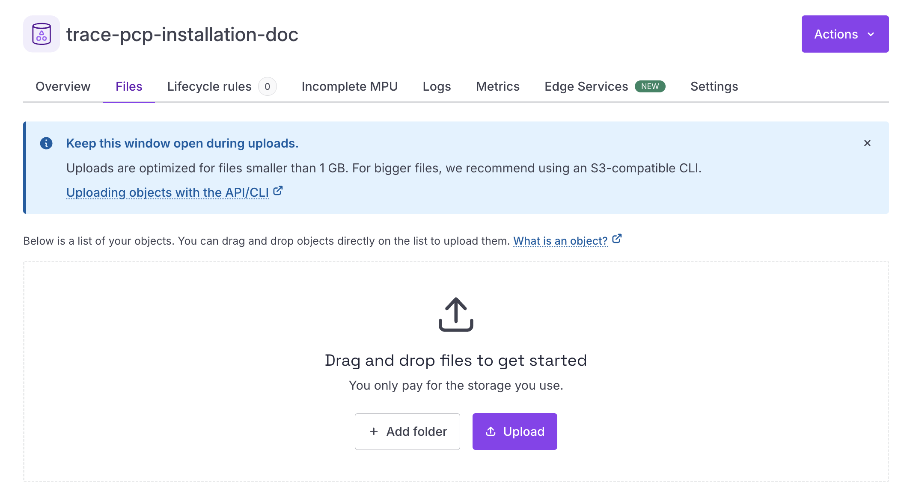
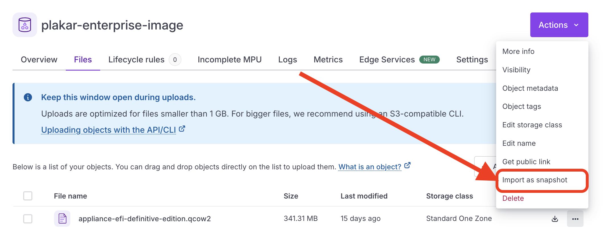
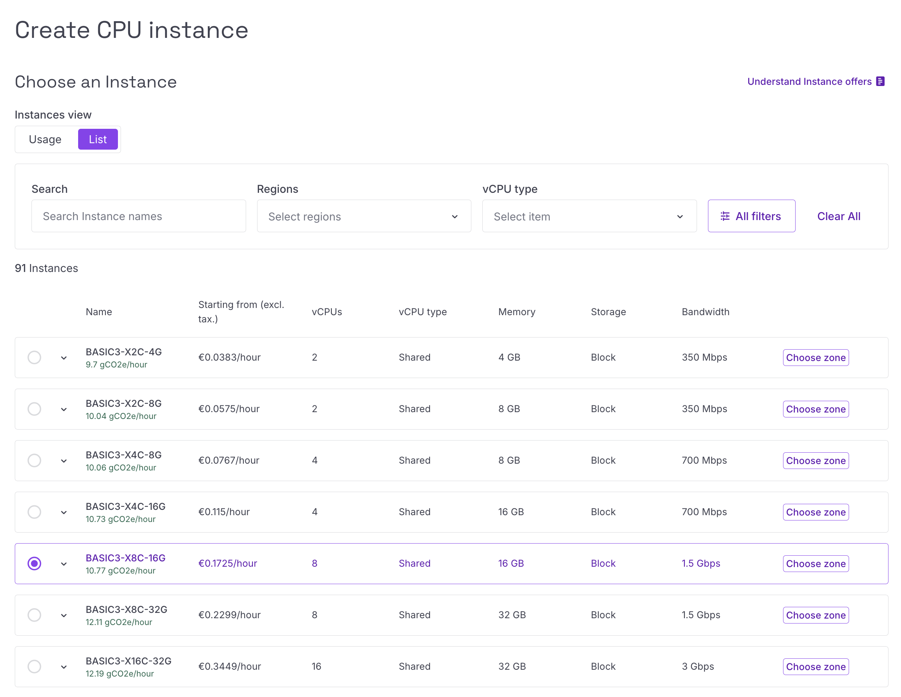
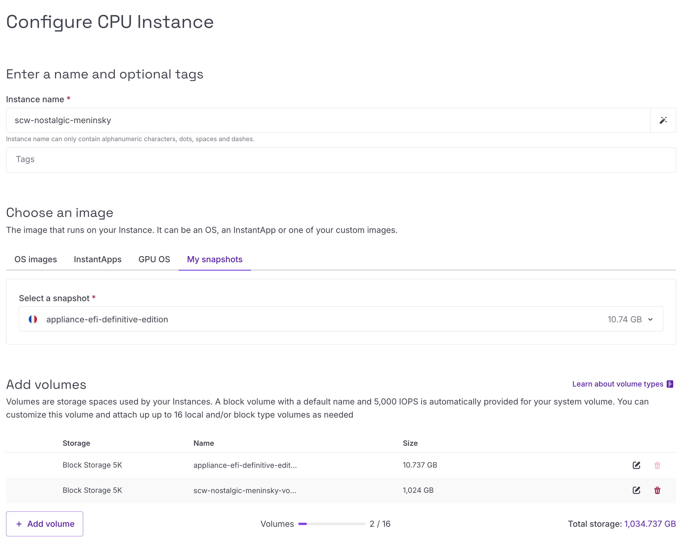
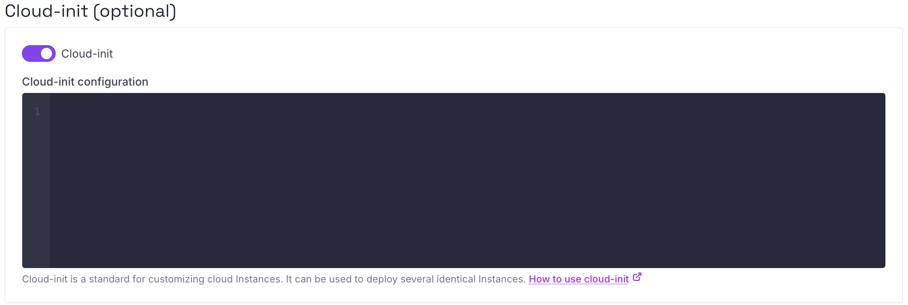

# Scaleway Installation

Plakar Control Plane is distributed for Scaleway as a QCOW2 virtual machine
image. The official QCOW2 image for Scaleway can be downloaded from:

- [Plakar Control Plane Downloads Page](https://www.plakar.io/download)

## Uploading the QCOW2 image to Scaleway Object Storage

Unlike marketplace-based deployments such as AWS AMIs, Scaleway instances cannot
boot directly from an uploaded QCOW2 image. The image must first be imported
into Scaleway Block Storage as a snapshot, which can then be attached as the
boot volume for the instance.

Before importing the image as a snapshot, the QCOW2 file must first be uploaded
to Scaleway Object Storage. Create an Object Storage bucket, then upload the
QCOW2 image to the bucket.



## Creating a Block Storage snapshot

Once the QCOW2 image has been uploaded, open the bucket **Files** page and
select **Import as snapshot** from the object actions menu.

Scaleway will convert the QCOW2 image into a Block Storage snapshot that can
later be attached as the root volume for the instance.



When importing the snapshot:

- Select the Scaleway zone where the snapshot should be created
- Select **Block Storage** as the snapshot type



> [!NOTE]+
>
> Scaleway instances can only attach block storage volumes from the same zone.
>
> The Object Storage bucket, Block Storage volumes, snapshots, and compute
> instance should also belong to the same Scaleway project.

## Creating the Scaleway instance

Create a new Scaleway compute instance using the Block Storage snapshot as the
boot source.

The instance must be created in the same Scaleway zone as the snapshot,
otherwise the snapshot will not be available for attachment as the root volume.

Plakar Control Plane is recommended to run on a machine with:

- **4 vCPUs**
- **16 GB RAM**

A configuration such as `BASIC3-X4C-16G` is suitable for most deployments.

These are recommendations for a production deployment. For evaluation or
testing, you can reduce CPU, RAM, and storage.



Select the Scaleway zone where the instance should be created, then continue to
the instance configuration step.

For the instance boot image:

1. Open the **My snapshots** section
2. Select the Block Storage snapshot created from the QCOW2 image



The Block Storage Snapshot volume is used only as the operating system boot
disk. Plakar Control Plane requires an additional persistent data volume that
stores the database, logs, and all Plakar state.

Attach an additional Block Storage volume with a recommended size of `1024 GB`.
Backups themselves are stored wherever you configure using apps.

## Proxy and Harbor Configuration

If the instance doesn't have direct internet access, configure an HTTP proxy, a
local Harbor registry mirror, or both through Scaleway's **cloud-init user
data** before creating the instance.



### What needs to be reachable

Plakar Control Plane requires HTTPS access to `api.plakar.io` for runtime
configuration, license validation, and plugin downloads. If your proxy uses a
whitelist instead of allowing all outbound traffic, you need to add
`*.plakar.io`

The appliance also needs to pull container images from `docker.io` and
`ghcr.io`. There are two supported approaches:

1. **Route image pulls through the HTTP proxy.** If you choose this option, the
   proxy should allow access to:
   - `*.docker.io`
   - `*.docker.com`
   - `*.ghcr.io`
   - `*.githubusercontent.com`

2. **Use a Harbor registry mirror.** This is the recommended approach for
   production deployments because images are pulled from a local registry cache
   instead of the public internet. When using Harbor, you don't need to
   whitelist the Docker and GitHub domains above on your proxy.

### Cloud-init configuration

The cloud-init user data is a standard YAML document containing `proxy:` and/or
`registry:` sections, depending on your environment.

```yaml
#cloud-config
proxy:
  http: http://<proxy-ip>:<proxy-port>
  https: http://<proxy-ip>:<proxy-port>
  no_proxy: .corp.example,10.0.0.0/8 # optional

registry:
  mirrors:
    docker.io: <harbor-host>/dockerhub-proxy
    ghcr.io: <harbor-host>/ghcr-proxy
  insecure: false # true: skip TLS verification for the mirror hosts
```

## Networking and Security Groups

The networking configuration below is intended for a basic deployment setup.

In production environments, networking and access control should be adapted to
match your infrastructure and security requirements. For example:

- Exposing Plakar Control Plane through a load balancer with HTTPS/TLS
  certificates
- Restricting access through a VPN or private network
- Limiting inbound traffic to trusted IP ranges
- Using internal-only networking

You'll need to assign both an IPv4 and IPv6 address to the instance.

When the instance is created, Scaleway automatically attaches the default
security group. Once the instance is running, open the instances page and go to
the **Security Group** tab.

Under the inbound rules configuration, set the default inbound policy to **drop
all**, then add a rule allowing inbound TCP traffic on port `80`.

The allowed source can be:

- Your public IP address
- Your organization gateway or VPN address
- `0.0.0.0/0` for temporary testing access

> [!WARNING]+
>
> Using `0.0.0.0/0` allows access from any IP address and should only be used
> for testing or temporary deployments.

## Accessing Plakar Control Plane

After the instance has started and the security group has been configured,
Plakar Control Plane can be accessed from your browser using:

```txt
http://<public-ipv4-address>
```

Where `<public-ipv4-address>` is the public IPv4 address assigned to the
instance. For first-time installations, you will be guided through the
enrollment process to:

- Register the instance with Plakar services for licensing and billing
- Create the initial administrator account

See the [enrollment](../../enrollment) documentation for more details.

