# Proxmox VE Installation

Plakar Control Plane can be deployed on Proxmox VE by creating a virtual machine
manually and booting it from the Plakar Control Plane ISO image. The official
ISO image can be downloaded from the
[Plakar Control Plane Downloads Page](https://www.plakar.io/download).

## Uploading the ISO

Before creating the virtual machine, the ISO needs to be added to a storage
location on your Proxmox node so it can be attached as installation media.

In the Proxmox web interface, select the storage you want to hold the ISO from
the left-hand tree, then open its **ISO Images** section. From here you can
either upload the file directly from your computer, or provide a publicly
accessible URL and have Proxmox download it for you. Either way, you can
optionally supply a checksum and select the hashing algorithm used, so Proxmox
verifies the file's integrity once it's added.

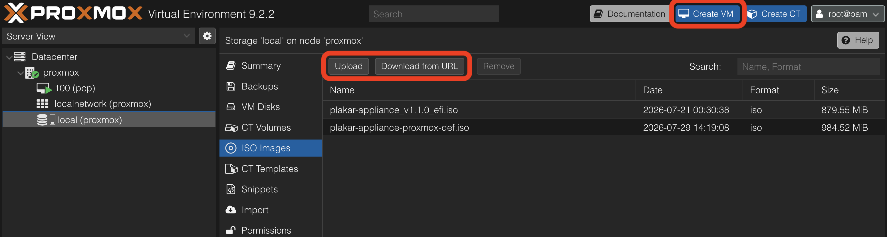

> [!NOTE]+
>
> Prefer a shared storage location if your Proxmox node is part of a cluster. An
> ISO or disk kept on node-local storage won't be reachable if the virtual
> machine ever needs to run on a different node.

## Creating the Virtual Machine

Click **Create VM** in the top-right of the Proxmox interface to open the
creation wizard.

### General

Give the virtual machine a name. The VM ID can be left at its pre-assigned value
unless you need a specific one for your environment.

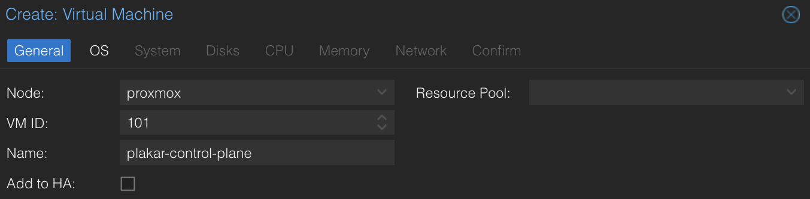

### OS

Set **Use CD/DVD disc image file (iso)**, choose the storage where you uploaded
the ISO, and select the Plakar Control Plane image from the list. For **Guest
OS**, set the type to **Linux** and the version to **7.x - 2.6 Kernel**.

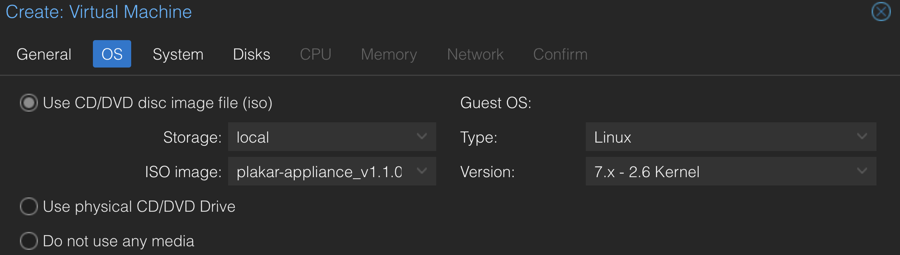

### System

Set **BIOS** to **OVMF (UEFI)** and check **Add EFI Disk**, selecting any
storage available to hold it. Leave the EFI disk format on the default (qcow2).

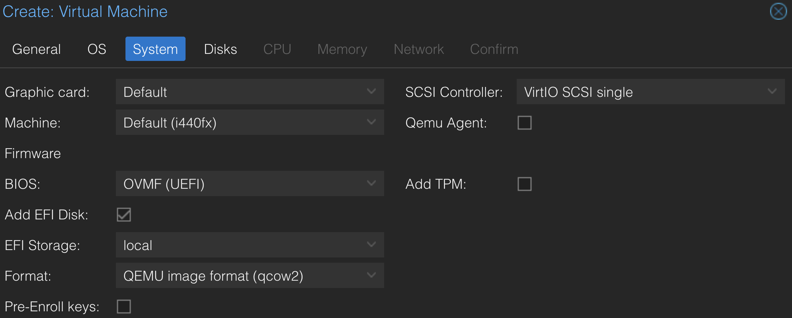

> [!WARNING]+
>
> Leave **Pre-Enroll keys** unchecked. This option enrolls Microsoft's default
> Secure Boot keys, and the appliance will fail to boot if it's enabled.

Everything else on this tab can be left at its default.

### Disks

Set the disk size to **1 TB**. This is the recommended size for a production
deployment. The disk stores the database, logs, and all Plakar state, separate
from wherever you configure backups themselves to be stored. For evaluation or
testing, a smaller disk is fine. Leave the format (qcow2) and storage selection
on default, or pick a specific storage if your node has more than one available.

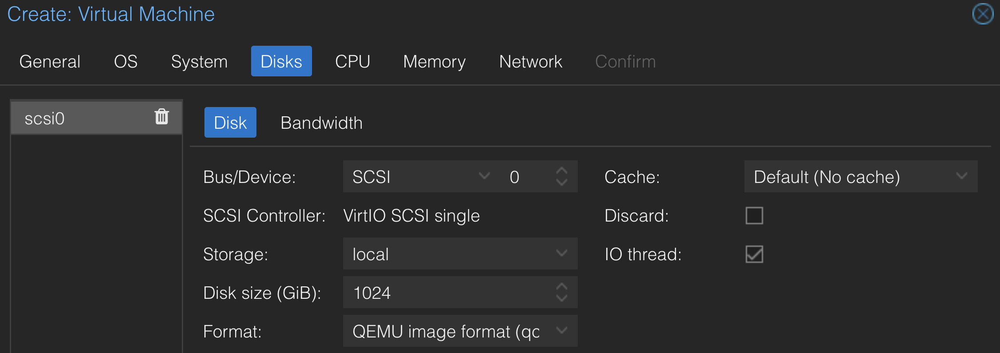

### CPU

Set **Cores** to **4** and **Sockets** to **1**. This is the recommended sizing
for production use. Leave **Type** on its default (`x86-64-v2-AES`). For
evaluation or testing, a smaller number of cores is fine.

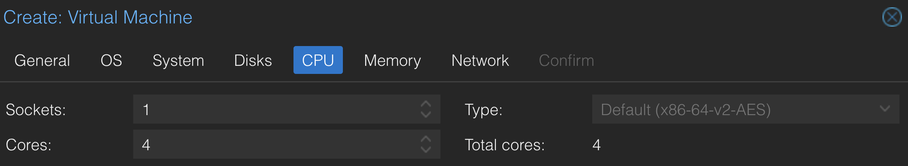

### Memory

Set memory to **16384 MiB** (16 GB), the recommended amount for production use.
For evaluation or testing, a smaller memory size is fine.

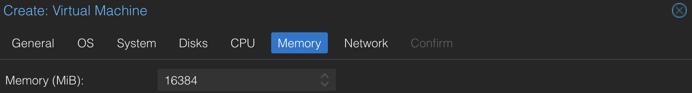

### Network

Select the network bridge the appliance should attach to. Leave the model on
**VirtIO**.

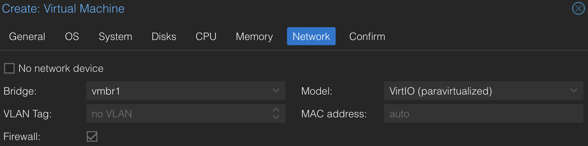

> [!NOTE]+
>
> By default the appliance receives its network configuration via DHCP, so a
> DHCP server must be running and reachable on the selected bridge. For a static
> IP instead, see the **Advanced** tab in
> [Configuring the Appliance](#configuring-the-appliance) below.

### Confirm

Review the summary of your selections, then click **Finish** to create the
virtual machine.

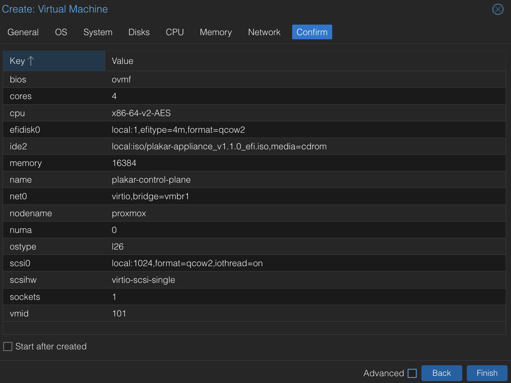

## Configuring the Appliance

By default the appliance boots with DHCP networking and no SSH access. If that's
enough for you, skip ahead to
[Start the appliance and complete enrollment](#start-the-appliance-and-complete-enrollment).
Otherwise, pick one of the two tabs below, not both. A Proxmox VM only takes a
single cloud-init user-data source, so if you use the Advanced tab's snippet,
set the SSH key there too, alongside any proxy, registry, or network settings,
instead of from the UI.





If SSH access is all you need (no proxy, no registry mirror, no static IP), set
the key from the Proxmox UI, no YAML required.

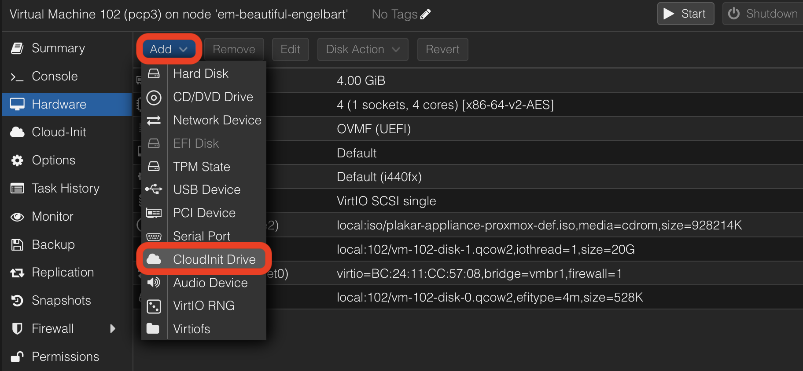

1. On the VM, go to **Hardware**, click **Add**, and select **CloudInit Drive**.
2. Set **Bus/Device** to **IDE**, and change the index from the default `0` to
   `3`, so the drive lands on `ide3`.
3. Choose a **Storage** location.
4. Leave **Format** on the default (QEMU image format, qcow2).
5. Click **Add**.



6. Open the **Cloud-Init** tab, click **SSH public key**, and paste in your
   public key, or upload the key file directly.

   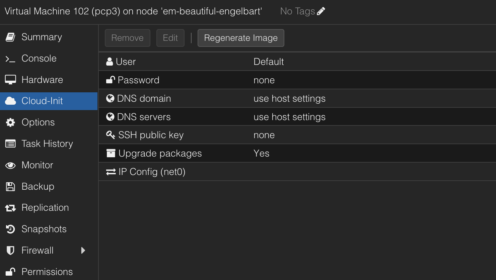





The Proxmox UI can only set an SSH key: it has no fields for a proxy, registry
mirror, or static IP. For any of those, write a single cloud-init YAML snippet
on the Proxmox node instead; it can carry all four settings at once, so include
only the keys you actually need.

### What needs to be reachable

Plakar Control Plane needs HTTPS access to `api.plakar.io` for runtime
configuration, license validation, and plugin downloads. If your proxy uses a
whitelist rather than allowing all traffic, `*.plakar.io` must be on it.

The appliance also needs to pull Docker images from `docker.io` and `ghcr.io`.
There are two supported approaches:

1. **Route image pulls through the same HTTP proxy.** If you take this route,
   the proxy must allow:
   - `*.docker.io`
   - `*.docker.com`
   - `*.ghcr.io`
   - `*.githubusercontent.com`
2. **Configure a Harbor registry mirror.** This is the preferred option for
   production, since it gives you a local cache of the images instead of pulling
   them over the internet on every deployment. If you use Harbor, you don't need
   to whitelist the domains above on your proxy.

### Write the user-data snippet

```bash
mkdir -p /var/lib/vz/snippets
cat > /var/lib/vz/snippets/plakar-appliance.yaml << 'EOF'
#cloud-config
proxy:
  http:  http://<proxy-ip>:<proxy-port>
  https: http://<proxy-ip>:<proxy-port>
  no_proxy: .corp.example,10.0.0.0/8       # optional

registry:
  mirrors:
    docker.io: <harbor-host>/dockerhub-proxy
    ghcr.io:   <harbor-host>/ghcr-proxy
  insecure: false     # true: skip TLS verification for the mirror hosts

network:
  ethernets:
    eth0:
      addresses: [10.0.1.5/24]             # CIDR suffix is mandatory
      gateway4: 10.0.1.1
      nameservers:
        addresses: [10.0.1.53, 10.0.1.54]

ssh_authorized_keys:
  - ssh-ed25519 AAAA...
EOF
```

Every top-level key above is optional; include only what you need. On Proxmox,
this `network:` key is the only network source ahead of the DHCP fallback:
whichever NICs it doesn't configure fall back to DHCP.

`network:` accepts a subset of [netplan v2](https://netplan.readthedocs.io/)
syntax, either under a top-level `network:` key (as above) or a bare
`ethernets:` key. The supported fields are `addresses` (first entry, CIDR
required), `gateway4`, `routes` (`{to, via}`, with `to: default` as an alias for
`gateway4`), `nameservers.addresses`, `dhcp4: true`, and `match.macaddress`. Use
`match.macaddress` to select a NIC by MAC address instead of its kernel name
(`eth0`, `eth1`, ... in PCI order, for multi-NIC VMs). A MAC match survives
adapter reordering. Anything else netplan defines, such as bonds, VLANs,
bridges, `dhcp6`, or `mtu`, is silently ignored.

- **One default gateway, one DNS set.** Declare `gateway4` (or a default route)
  and `nameservers` on exactly one interface — the management one. If several
  interfaces declare either, the first by interface name wins and the others are
  logged and ignored.
- **Unlisted NICs fall back to DHCP.** Any NIC without a stanza, or with a
  stanza that fails validation, is picked up by the DHCP client. A NIC on a
  segment without a DHCP server simply stays unconfigured.
- **The first NIC (`eth0`) is special**: when it is DHCP-configured, boot waits
  for its lease. Leases on other NICs are acquired in the background and never
  delay boot.
- Static addressing is outbound-only: the appliance's own services (UI, SSH)
  listen on **all** interfaces regardless of this configuration. Restrict access
  to the management plane with your network policy.

> [!NOTE]+
>
> Proxmox's own IP configuration fields on the Cloud-Init tab (`ipconfig0` and
> friends) are not read by the appliance — they land in a separate
> `network-config` file the appliance does not consume. Static addressing must
> go through the `network:` key above instead.

The Proxmox web interface only lists existing snippets under **Storage →
Snippets** it has no option to create or upload one. Snippets have to be placed
directly on disk, e.g. via the node's shell. On the default `local` storage,
that path is `/var/lib/vz/snippets/`.

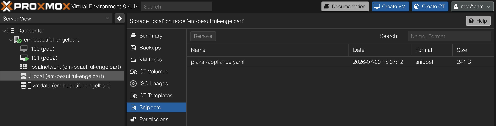

### Attach the user-data to the VM

Add a cloud-init drive so Proxmox can generate the cidata image, and point it at
your snippet. The cloud-init drive must always be attached at `ide3`:

```bash
qm set <vmid> --ide3 local:cloudinit
qm set <vmid> --cicustom "user=local:snippets/plakar-appliance.yaml"
qm cloudinit update <vmid>
```

### Apply and reboot

```bash
qm reboot <vmid>
```

### Verify

Watch the console during boot for lines prefixed `proxy-collect:` (proxy and
registry) and `net-collect:` / `net-apply:` (network). Each reports the
configuration that was applied, or why none was found:

```txt
proxy-collect: proxy configured: http=http://<proxy-ip>:<proxy-port> https=... no_proxy=...
```

Configuration is collected once per boot. Changes to the snippet take effect on
the next reboot.





## Start the appliance and complete enrollment

Power on the virtual machine. Once the appliance has booted and is reachable on
the network, open it from a browser using its assigned IP address.

```txt
http://<ASSIGNED-IP>
```

> [!NOTE]+
>
> If the appliance is on a private or NAT'd bridge that isn't directly reachable
> from your browser, you can forward a port on the Proxmox host's public
> interface to the appliance instead:
>
> ```bash
> iptables -t nat -A PREROUTING -i <public-bridge> -p tcp --dport <public-port> -j DNAT --to-destination <appliance-ip>:80
> iptables -t nat -A POSTROUTING -o <private-bridge> -p tcp -d <appliance-ip> --dport 80 -j MASQUERADE
> ```
>
> Then browse to `http://<proxmox-host-public-ip>:<public-port>`.

For production environments, restrict access to trusted IP ranges, private
networking, a VPN, or a reverse proxy or load balancer with TLS.

For first-time installations, you will be guided through the enrollment process
to:

- Register the instance with Plakar services for licensing and billing
- Create the initial administrator account

See the [enrollment](../../enrollment) documentation for more details.

