# VMware vSphere Installation

Plakar Control Plane can be deployed on vCenter using the vSphere HTML Client.
Two deployment methods are supported:

- **OVA**: imports a pre-built appliance with the recommended virtual machine
  configuration already defined, including CPU and memory settings
- **ISO**: creates a virtual machine manually and boot from the Plakar Control
  Plane ISO image, requiring the virtual machine configuration to be done
  manually

Both images can be downloaded from the
[Plakar Control Plane Downloads Page](https://www.plakar.io/download).

## Creating the Virtual Machine





In the vSphere HTML Client, open **Hosts and Clusters** (first column on the
sidebar), right-click the datacenter that will contain the appliance, and select
**Deploy OVF Template**.

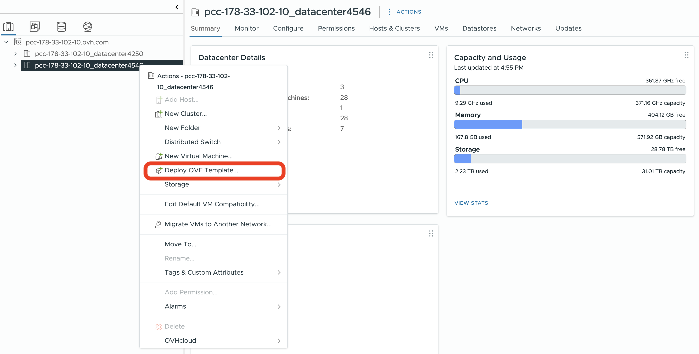

### Select an OVF template

The deployment wizard supports both a local file upload and a remote HTTP or
HTTPS URL. For most deployments, choose **Local file** and upload the Plakar OVA
from your workstation.

> [!WARNING]+
>
> URL-based imports are more sensitive to reachability and URL format than a
> direct upload. If you use the URL option, the OVA must be hosted at a stable,
> directly reachable HTTP or HTTPS URL that the VMware infrastructure can fetch.
> For a standalone installation, a local file upload is the more predictable
> path.

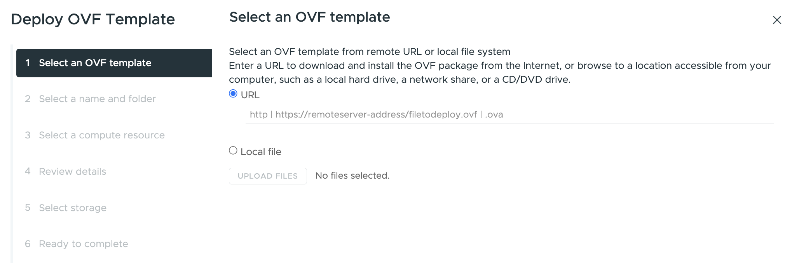

### Specify a name and target location

Enter a name for the virtual machine and select the datacenter as the target
location.

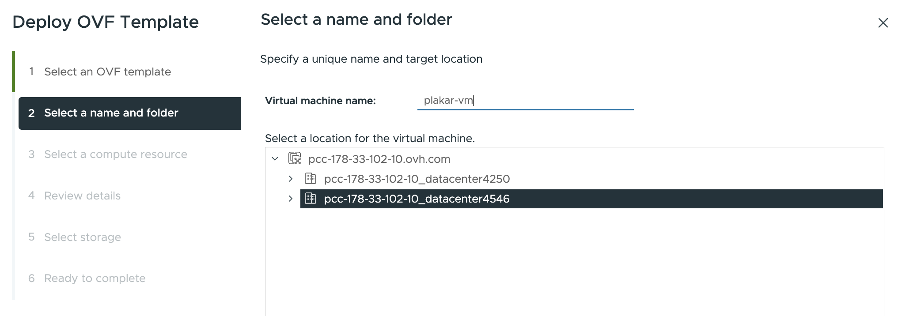

### Select a compute resource

Select the destination compute resource for the datacenter. This will typically
be your cluster, for example `Cluster1`.

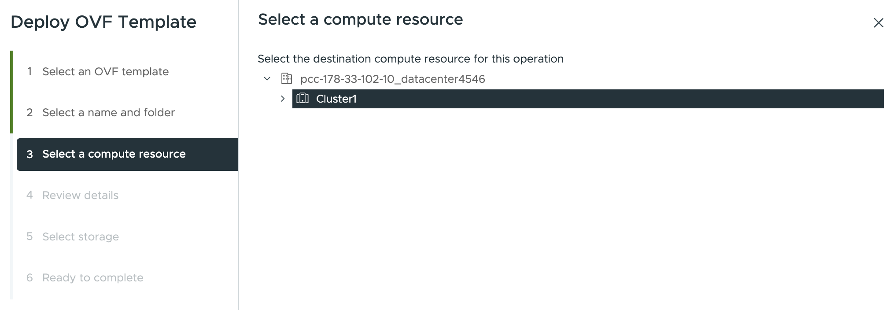

### Review details

The wizard displays package metadata for the OVA. It is normal for vSphere to
warn that the OVF package contains advanced configuration options. VMware
documents that these settings can include BIOS UUID information, MAC addresses,
boot order, and PCI slot numbers. If the OVA was downloaded from the Plakar
downloads page, this warning is expected and can be dismissed by clicking
**Next**.

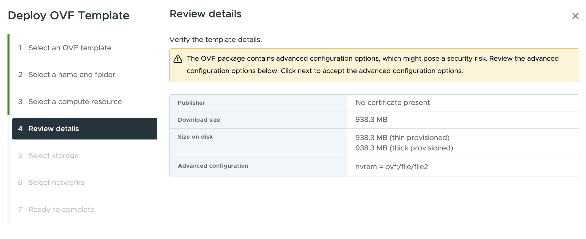

### Select storage

Select the datastore that will hold the virtual machine configuration and disk
files.

> [!NOTE]+
>
> Avoid selecting a host-local datastore such as `storageLocal` for production
> deployments. A host failure will leave the virtual machine unable to restart
> if its disk files are on local storage that is not accessible to other hosts
> in the cluster.

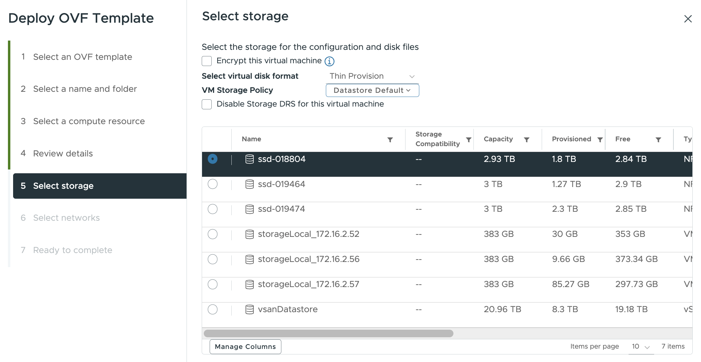

### Select networks

Map the source network to the destination network segment you have prepared in
your vCenter environment. If your environment uses an NSX-backed network
segment, select it as the destination network, for example `plakar-network`.

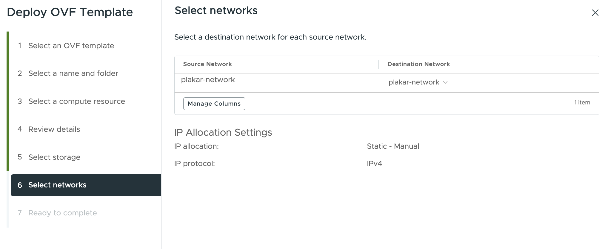

### Ready to complete

Review your selections and click **Finish**. You can monitor the import progress
from **Recent Tasks** until the virtual machine appears in the inventory.

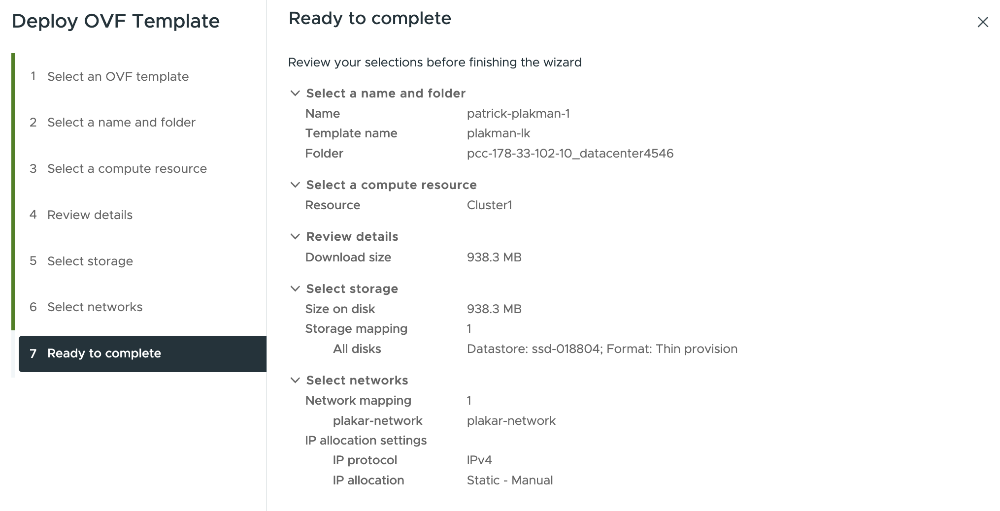





The ISO installation method creates a new virtual machine manually and boots it
from the Plakar Control Plane ISO image. This method is used when you want to
configure the virtual machine hardware yourself instead of importing the
pre-built OVA appliance.

### Upload the ISO to a datastore

Before creating the virtual machine, upload the Plakar Control Plane ISO to a
datastore that can be accessed by the host or cluster that will run the
appliance.

In the vSphere HTML Client, open the datastore where you want to store the ISO,
then open the Files view. Create a folder for ISO images if needed, then upload
the Plakar Control Plane ISO from your workstation.

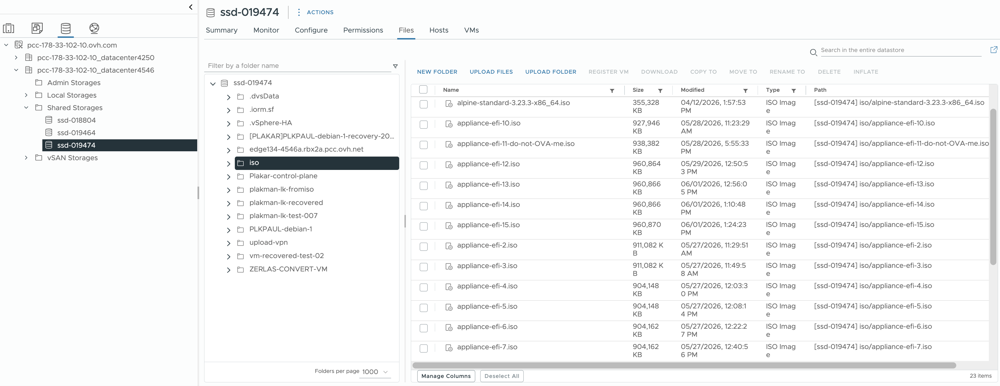

> [!NOTE]+
>
> Prefer a shared datastore for ISO images and production virtual machines.
> Keeping the ISO or the virtual machine disk files on host-local storage can
> cause access issues when the VM needs to run on another host.

### Create a new virtual machine

In the vSphere HTML Client, open **Hosts and Clusters** (first column on the
sidebar), right-click the datacenter that will contain the appliance, and select
**New Virtual Machine**.

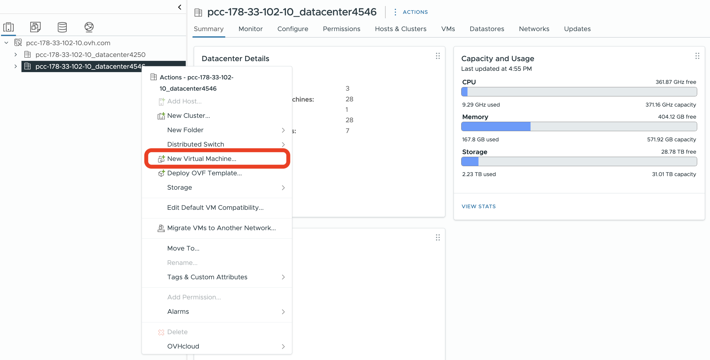

### Select a creation type

Select **Create a new virtual machine** and click **Next**.

### Specify a name and target location {#iso-specify-a-name-and-target-location}

Enter a name for the virtual machine and select the datacenter as the target
location.

### Select a compute resource {#iso-select-a-compute-resource}

Select the destination compute resource for the datacenter. This will typically
be your cluster, for example `Cluster1`.

### Select storage {#iso-select-storage}

Select the datastore that will hold the virtual machine configuration and disk
files.

> [!NOTE]+
>
> Avoid selecting a host-local datastore such as `storageLocal` for production
> deployments. A host failure will leave the virtual machine unable to restart
> if its disk files are on local storage that is not accessible to other hosts
> in the cluster.

### Select compatibility

The compatibility setting determines the virtual hardware version available to
the virtual machine. Leave this at the default, **ESXi 8.0 U2 and later**
(hardware version 21), which provides the best performance and access to the
latest features supported by your vCenter environment. Click **Next**.

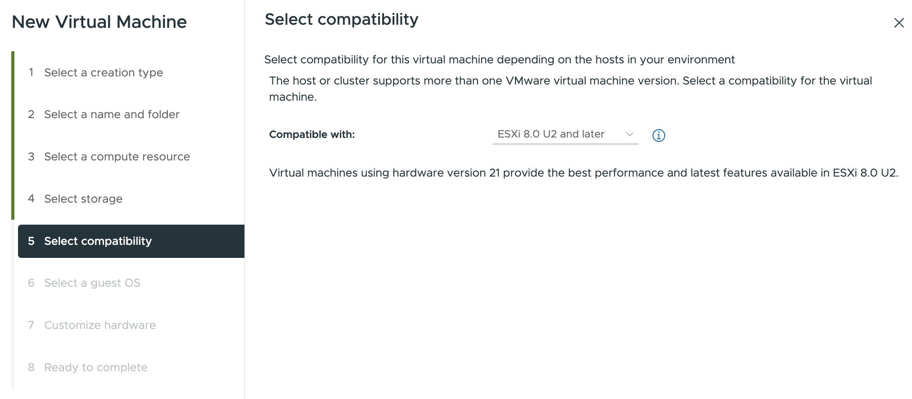

### Select a guest OS

Set the guest OS family to **Linux**, then select the closest modern 64-bit
Linux profile available in your vCenter. On many vSphere 8 environments, this
option is **Other 6.x or later Linux (64-bit)**. Click Next.

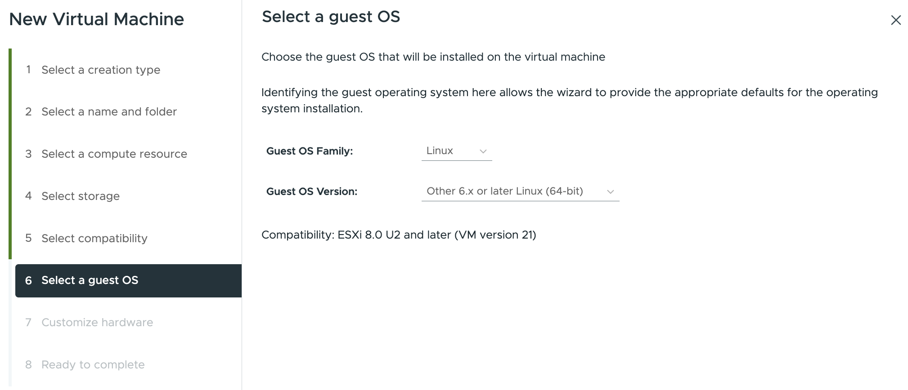

### Customize hardware

Configure the virtual machine with the recommended Plakar Control Plane sizing:

- CPU: 4vCPU
- Memory: 16 GB
- Hard disk: 1 TB

These are recommendations for a production deployment. For evaluation or
testing, you can reduce CPU, RAM, and storage. The data disk stores the
database, logs, and all Plakar state. Backups themselves are stored wherever you
configure using apps.

For the **CD/DVD Drive**, select **Datastore ISO File**, then browse to the
Plakar Control Plane ISO that you uploaded earlier. Enable **Connect At Power
On** so that the virtual machine boots from the ISO when it starts.

Attach the network adapter to the network segment you prepared for the
appliance, such as your NSX-backed segment or another destination network in
your vCenter environment. Select **Browse** then select your network, for
example `plakar-network`.

Other hardware settings can be left at their default values.

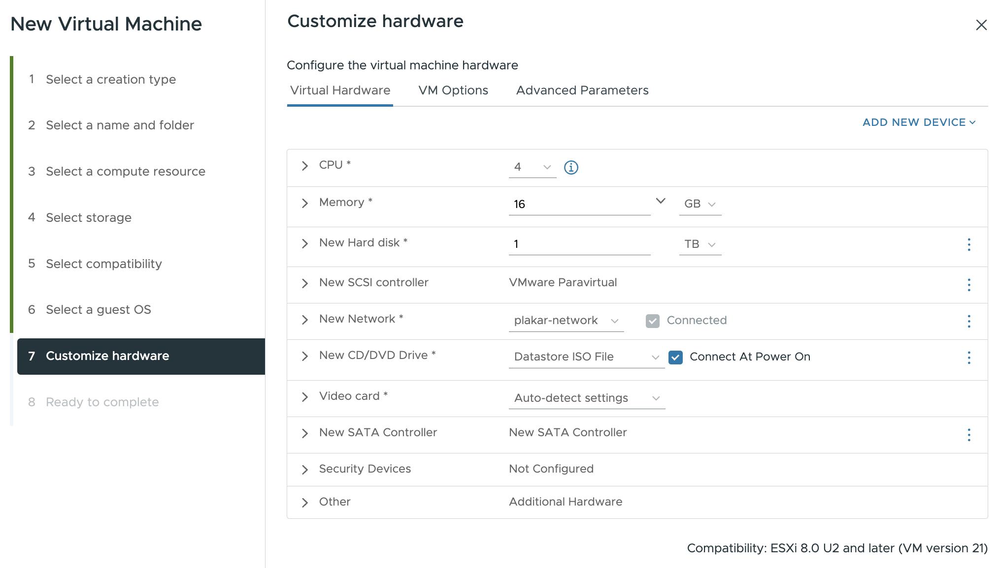





## Add the data disk

On the ISO path, the recommended 1 TB storage is already configured during
virtual machine creation, so this step is OVA-only. Before first power-on,
right-click the VM, select **Edit settings**, open the **Virtual Hardware** tab,
click **Add New Device**, select **Hard Disk**, and set it to 1 TB.

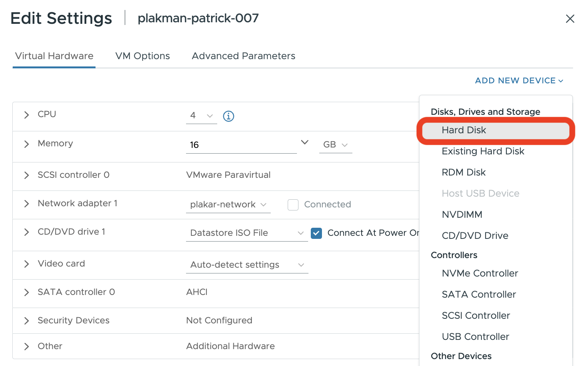

## Configuring the Appliance

By default the appliance boots with DHCP networking and no SSH access. If that's
enough for you, skip ahead to
[Start the appliance and complete enrollment](#start-the-appliance-and-complete-enrollment).
Otherwise, every other setting (static IP, proxy, registry mirror, SSH key) is
delivered through vSphere's guest info mechanism, added under **Advanced
Parameters** before first power-on, or during the Deploy-OVF wizard's Customize
Template step on the OVA path. Pick one of the two tabs below.

### What needs to be reachable

Plakar Control Plane requires HTTPS access to `api.plakar.io` for runtime
configuration, license validation, and plugin downloads. If your proxy uses a
whitelist instead of allowing all outbound traffic, add `*.plakar.io`.

The appliance also needs to pull container images from `docker.io` and
`ghcr.io`. There are two supported approaches:

1. **Route image pulls through the HTTP proxy.** If you choose this option, the
   proxy should allow access to:
   - `*.docker.io`
   - `*.docker.com`
   - `*.ghcr.io`
   - `*.githubusercontent.com`
2. **Use a Harbor registry mirror.** This is the recommended approach for
   production deployments because images are pulled from a local registry cache
   instead of the public internet. When using Harbor, you don't need to
   whitelist the Docker and GitHub domains above on your proxy.





For a single NIC and straightforward settings, every option is its own
`guestinfo.plakar.*` parameter, no YAML required.

For a static IP, set `guestinfo.plakar.ip`, `guestinfo.plakar.gateway`, and
`guestinfo.plakar.dns` together: all three are required for this channel to take
effect. The proxy, registry, and SSH parameters below are independent of the
network ones and of each other, so add only the ones you actually need.

| Parameter                              | Description                                             |
| -------------------------------------- | ------------------------------------------------------- |
| `guestinfo.plakar.ip`                  | Appliance IP address with CIDR mask                     |
| `guestinfo.plakar.gateway`             | Network gateway for the selected segment                |
| `guestinfo.plakar.dns`                 | DNS resolver used by the appliance, e.g. `1.1.1.1`      |
| `guestinfo.plakar.http_proxy`          | HTTP proxy URL                                          |
| `guestinfo.plakar.https_proxy`         | HTTPS proxy URL (defaults to the HTTP proxy if omitted) |
| `guestinfo.plakar.no_proxy`            | Comma-separated bypass list                             |
| `guestinfo.plakar.registry_mirrors`    | Comma-separated `upstream=prefix` pairs                 |
| `guestinfo.plakar.registry_insecure`   | `true` to skip TLS verification for the mirror hosts    |
| `guestinfo.plakar.ssh_authorized_keys` | Contents of your SSH public key                         |

The gateway can usually be found from the NSX network segment configuration.

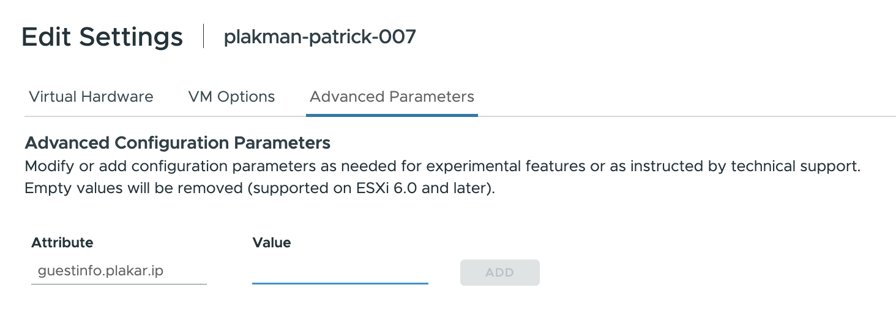





For multiple NICs, static routes, or to bundle every setting into one document,
use one of these two YAML channels instead of the flat keys.

### Netplan via `guestinfo.metadata` (network only, multi-NIC)

The appliance evaluates the sources in order. As soon as one source successfully
defines at least one network interface, it is used and all remaining sources are
ignored.

1. `guestinfo.metadata` (this channel)
2. An OVF property set during the Deploy-OVF wizard's Customize Template step,
   if the deployed OVA defines one
3. The flat `guestinfo.plakar.*` keys, from the Basic tab
4. A `network:` key inside `guestinfo.userdata`, below
5. DHCP fallback

A [netplan v2](https://netplan.readthedocs.io/) YAML document, under a top-level
`network:` key or a bare `ethernets:` key:

```yaml
network:
  ethernets:
    eth0:
      addresses: [10.0.1.5/24] # CIDR suffix is mandatory
      gateway4: 10.0.1.1
      nameservers:
        addresses: [10.0.1.53, 10.0.1.54]
    eth1:
      addresses: [10.20.0.5/24]
      routes: # reach sources behind a router on this segment
        - to: 10.50.0.0/16
          via: 10.20.0.1
    eth2:
      dhcp4: true
```

Only a subset of netplan is supported: `addresses` (first entry, CIDR required),
`gateway4`, `routes` (`{to, via}`, with `to: default` as an alias for
`gateway4`), `nameservers.addresses`, `dhcp4: true`, and `match.macaddress` to
select a NIC by MAC address instead of its kernel name. A MAC match survives
adapter reordering, unlike the PCI-order `eth0`/`eth1` kernel names:

```yaml
backup-a:
  match: { macaddress: "00:50:56:aa:bb:cc" }
  addresses: [10.20.0.5/24]
```

The Advanced Parameters field is single-line, so base64-encode the document
before pasting it in:

```sh
base64 -w0 < netplan.yaml
```

| Parameter                     | Description                                        |
| ----------------------------- | -------------------------------------------------- |
| `guestinfo.metadata`          | Netplan YAML document, encoded per the field below |
| `guestinfo.metadata.encoding` | `base64`, `gzip+base64`, or omitted for raw YAML   |

### Cloud-init via `guestinfo.userdata` (proxy, registry, network, SSH)

A single cloud-config document can carry `proxy:`, `registry:`, `network:`, and
`ssh_authorized_keys:` together, so include only the keys you need:

```yaml
#cloud-config
proxy:
  http: http://<proxy-ip>:<proxy-port>
  https: http://<proxy-ip>:<proxy-port>
  no_proxy: .corp.example,10.0.0.0/8 # optional

registry:
  mirrors:
    docker.io: <harbor-host>/dockerhub-proxy
    ghcr.io: <harbor-host>/ghcr-proxy
  insecure: false # true: skip TLS verification for the mirror hosts

network:
  ethernets:
    eth0:
      addresses: [10.0.1.5/24]
      gateway4: 10.0.1.1
      nameservers:
        addresses: [10.0.1.53]

ssh_authorized_keys:
  - ssh-ed25519 AAAA...
```

`network:` accepts the same netplan subset described above.

For VMware, we recommend the equivalent single-line YAML format instead: the
`guestinfo.userdata` field is single-line, so line breaks are removed when the
value is entered, and the compact form is easier to copy and paste:

<!-- prettier-ignore-start -->
```yaml
{ proxy: { http: "http://<proxy-ip>:<proxy-port>", https: "http://<proxy-ip>:<proxy-port>", no_proxy: ".corp.example,10.0.0.0/8" }, registry: { mirrors: { docker.io: "<harbor-host>/dockerhub-proxy", ghcr.io: "<harbor-host>/ghcr-proxy" }, insecure: false } }
```
<!-- prettier-ignore-end -->

| Parameter            | Description                                                |
| -------------------- | ---------------------------------------------------------- |
| `guestinfo.userdata` | Cloud-init document containing any of the keys shown above |

Alternatively, the OVF property `plakar.userdata` can carry the same document,
base64-encoded, via the Deploy-OVF wizard's Customize Template step, instead of
Advanced Parameters.





### Connect over SSH

If you configured an SSH key, connect to the booted appliance with the `plakar`
user:

```sh
ssh plakar@<ASSIGNED-IP>
```

Replace `<ASSIGNED-IP>` with the appliance's configured or DHCP-assigned IP
address.

## Start the appliance and complete enrollment

Power on the virtual machine. Once the appliance has booted and is reachable on
the network, open it from a browser using its assigned IP address.

```txt
http://<ASSIGNED-IP>
```

For production environments, restrict access to trusted IP ranges, private
networking, a VPN, or a reverse proxy or load balancer with TLS.

For first-time installations, you will be guided through the enrollment process
to:

- Register the instance with Plakar services for licensing and billing
- Create the initial administrator account

See the [enrollment](../../enrollment) documentation for more details.

