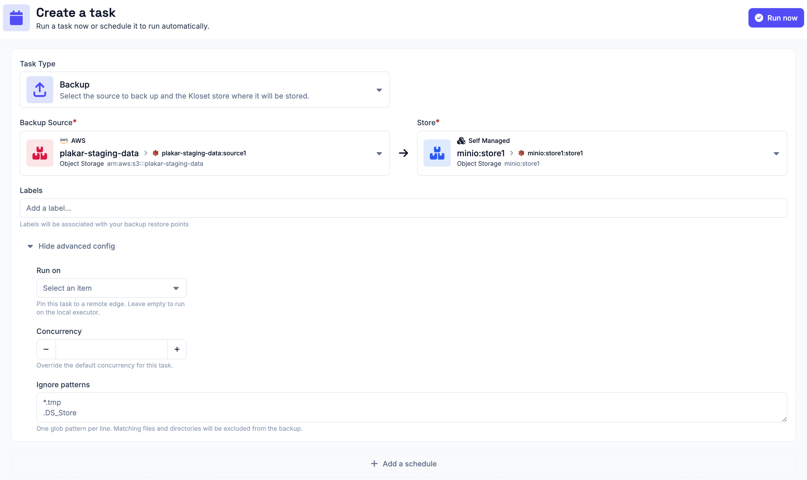
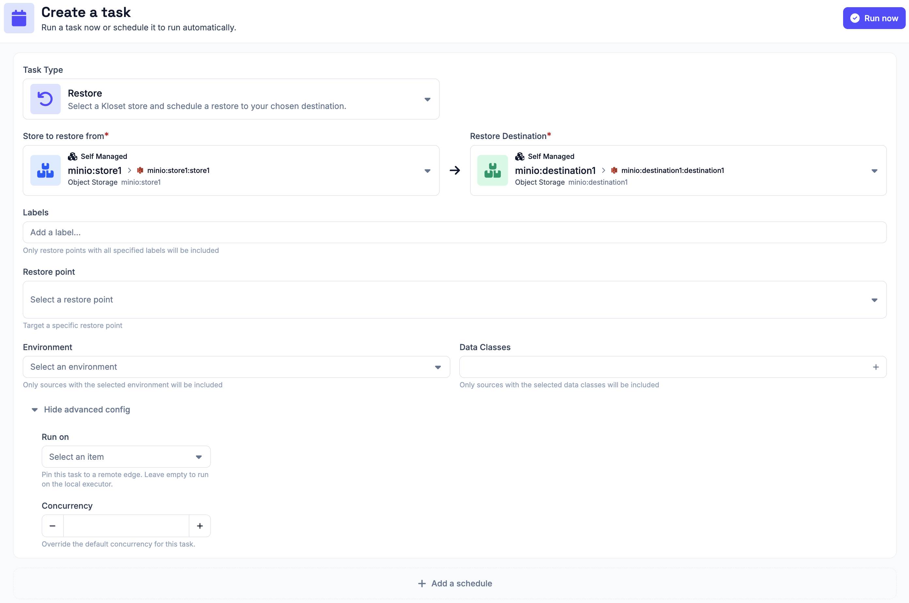
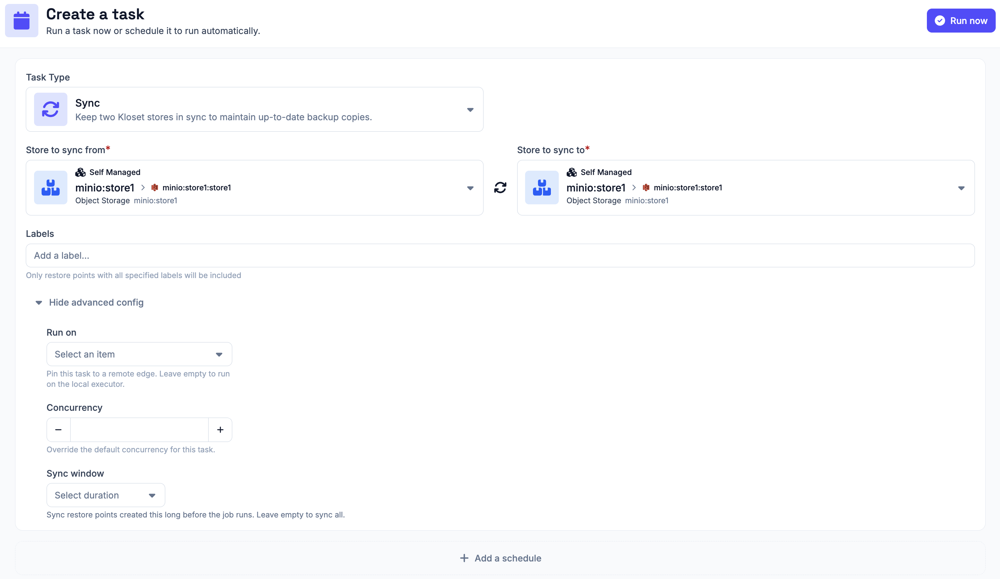
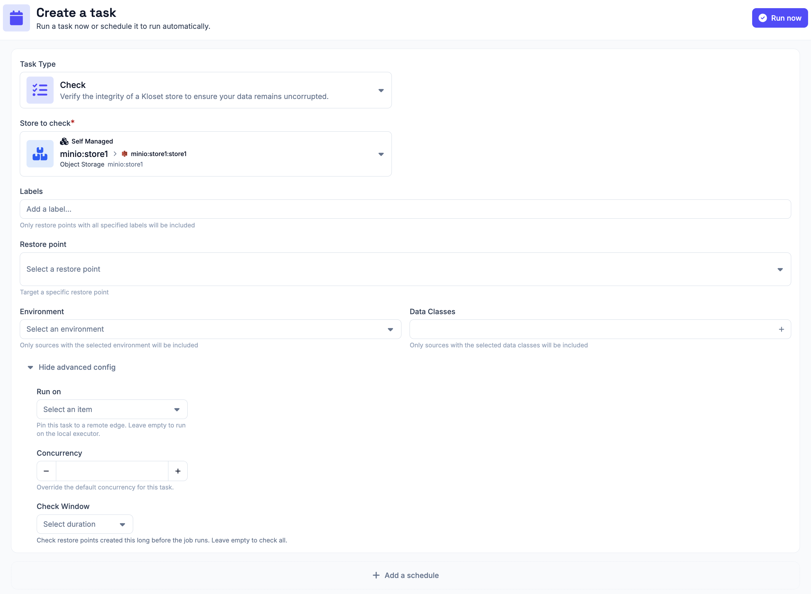

# Scheduled Tasks

Plakar Control Plane runs operations as tasks. There are four types of tasks,
each requiring a different combination of apps. Any task can be run once as a
one-off operation or attached to a schedule so that it repeats automatically.

## Backup Task

A backup task stores backup data from a source app into a store app. It requires
a source app and a store app.

You can specify label(s) for your backups. This will be associated with your
restore points and can later be used as filters for your restore points.

### Advanced Config

- **Run on**: Enables you to select a remote edge executor to run the task on.
  If left empty, the task runs on the local executor in your Control Plane
  instance. Check the [edge documentation](../../infrastructure/edges) for more
  information on remote executors for Control Plane.
- **Concurrency**: This controls how many operations the backup task runs in
  parallel. Plakar Control Plane automatically sets a recommended concurrency
  for each operation its doing. Only change this if you have a specific reason
  to do so.
- **Ignore patterns**: One glob pattern per line. Matching files and directories
  are excluded from the backup.

## Restore Task

A restore task restores data from a store app to a destination app. It requires
a store app and a destination app.

You can specify label(s) to filter your restore points. Only the restore points
matching all the provided labels will be displayed.

You can also specify a particular restore point in the store to restore from. If
no restore point is selected, Plakar Control Plane restores the latest available
restore point.

Environment and data class filters let you narrow the snapshot list further,
showing only restore points that match the specified environment and data class.

### Advanced Config

- **Run on**: Enables you to select a remote edge executor to run the task on.
  If left empty, the task runs on the local executor in your Control Plane
  instance. Check the [edge documentation](../../infrastructure/edges) for more
  information on remote executors for Control Plane.
- **Concurrency**: This controls how many operations the backup task runs in
  parallel. Plakar Control Plane automatically sets a recommended concurrency
  for each operation its doing. Only change this if you have a specific reason
  to do so.

## Sync Task

A sync task copies backup data from one store app to another. It requires two
store app. This is useful for replicating backups to a second location or a
different storage tier.

You can specify label(s) to filter your restore points. Only the restore points
matching all the provided labels will be synced to the other store.

### Advanced Config

- **Run on**: Enables you to select a remote edge executor to run the task on.
  If left empty, the task runs on the local executor in your Control Plane
  instance. Check the [edge documentation](../../infrastructure/edges) for more
  information on remote executors for Control Plane.
- **Concurrency**: This controls how many operations the backup task runs in
  parallel. Plakar Control Plane automatically sets a recommended concurrency
  for each operation its doing. Only change this if you have a specific reason
  to do so.
- **Sync Window**: The sync window limits which snapshots the sync task copies.
  Only snapshots created within the selected duration before the job runs will
  be synced. Leave the field empty to sync all snapshots.

## Check Task

A check task verifies the integrity of data in a store app. It checks that the
backup data can be read correctly and validates file MACs to make sure no
corruption has occurred. It is performed on a store app.

By default, when no filters or restore point are specified, the entire store is
checked. If you select a specific restore point, only that restore point is
checked.

You can specify label(s) to filter your restore points. Only the restore points
matching all the provided labels will be displayed. Environment and data class
filters let you narrow the snapshot list further, showing only restore points
that match the specified environment and data class.

If you apply labels, environment, and/or data class filters without selecting a
specific restore point, only the restore points matching those filters are
checked, not the entire store.

### Advanced Config

- **Run on**: Enables you to select a remote edge executor to run the task on.
  If left empty, the task runs on the local executor in your Control Plane
  instance. Check the [edge documentation](../../infrastructure/edges) for more
  information on remote executors for Control Plane.
- **Concurrency**: This controls how many operations the backup task runs in
  parallel. Plakar Control Plane automatically sets a recommended concurrency
  for each operation its doing. Only change this if you have a specific reason
  to do so.
- **Check Window**: The check window limits which snapshots the check task
  inspects. Only snapshots created within the selected duration before the job
  runs will be checked. Leave the field empty to check all snapshots.

