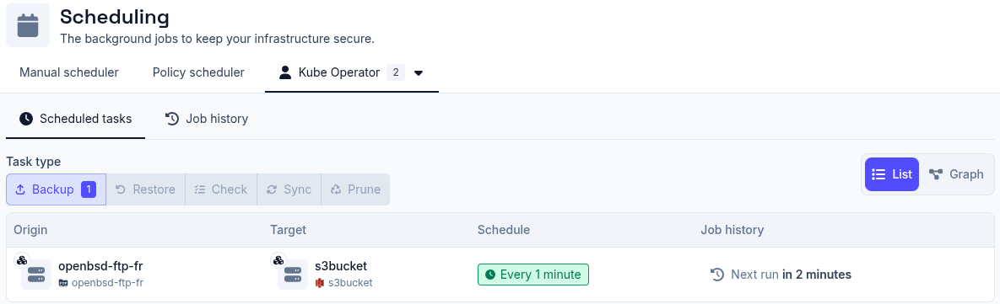

# User Schedulers

Every [Application user](../../administration/users#application-users) can have
its own scheduler. Unlike the [manual](../manual-scheduler) and
[policy](../policy-scheduler) schedulers, a user scheduler is not created from
the UI. Application users authenticate with an API key rather than signing in,
so their scheduler can currently only be created and managed through the Plakar
Control Plane API, using that user's API key.

An Application user has no scheduler by default. It must explicitly create one
through the API before it can schedule any tasks. Once created, the user can
manage its own scheduled tasks independently of the manual and policy
schedulers.

The **User schedulers** tab in **Operations > Scheduling** lists every
Application user that has created a scheduler, showing how many tasks it manages
and when it last ran a job. Selecting a user scheduler enables you to view its
own scheduled tasks and job history, the same way the
[manual scheduler](../manual-scheduler) and
[policy scheduler](../policy-scheduler) tabs shows their own. See the
[job history documentation](../job-history) for details on monitoring job
progress, viewing job output, and finding jobs on app pages.

## Kubernetes Operator

The [Kubernetes Operator](../../infrastructure-as-code/kubernetes-operator) is
currently the only client that creates a user scheduler. It authenticates as an
Application user and, when it connects to Plakar Control Plane, creates a
scheduler for that user if one doesn't already exist. From then on, every
`ScheduleBackup`, `ScheduleCheck`, and `ScheduleSync` resource it manages
appears under that user's entry in the **User schedulers** tab. See
[Scheduling](../../infrastructure-as-code/kubernetes-operator/scheduling) for
how the operator represents these tasks and their job history as Kubernetes
resources.

