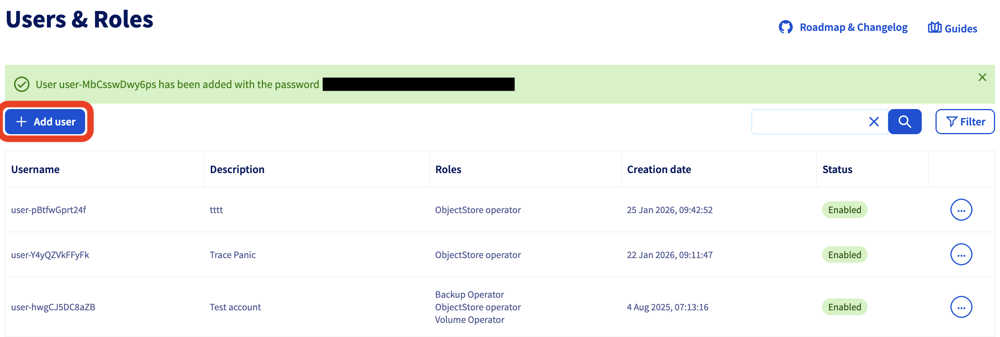
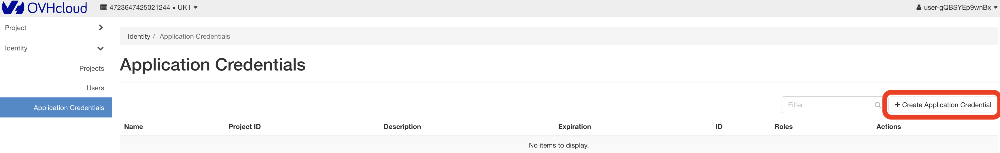

# OVHcloud Compute

OVHcloud Compute resources represent OVHcloud Public Cloud instances. Plakar
Control Plane backs up an instance by snapshotting its boot disk and any
attached Cinder volumes as temporary Glance images, then streams the image data
directly into the Kloset store and recreates the instance during a restore.

## Inventory Management

[Managed inventories](../../infrastructure/inventories#managed-inventories) can
discover OVHcloud Compute instances automatically once connected to your
OVHcloud Public Cloud project. OVHcloud Compute resources are only discovered by
the [OVHcloud inventory](../../infrastructure/inventories/ovhcloud) and cannot
be setup by a self-managed inventory.

#### Backup flow

<!-- prettier-ignore-start -->

flowchart TD
  subgraph OVHcloud["OVHcloud Public Cloud Project"]
    Instance["Compute Instance"]
    Volumes["Attached Cinder Volumes"]
    Glance["Temporary Glance Images"]
  end
  subgraph Plakar["Plakar Control Plane"]
    Source["OVHcloud Compute Source app"]
    Backup["Backup process Encrypt & deduplicate"]
  end
  Store["Kloset Store"]
  Source -->|"Nova: snapshot boot disk"| Instance
  Source -->|"Cinder: export volume   to image"| Volumes
  Instance --> Glance
  Volumes --> Glance
  Glance -->|"download image data"| Source
  Source --> Backup
  Backup --> Store

<!-- prettier-ignore-end -->

#### Restore flow

<!-- prettier-ignore-start -->

flowchart TD
  Store["Kloset Store"]
  subgraph Plakar["Plakar Control Plane"]
    Destination["OVHcloud Compute Destination app"]
    Restore["Restore process"]
  end
  subgraph OVHcloud["OVHcloud Public Cloud Project"]
    Glance["Glance Images"]
    NewInstance["New Compute Instance"]
    NewVolumes["New Cinder Volumes"]
  end
  Store --> Restore
  Destination --> Restore
  Restore -->|"uploads QCOW2 disk data"| Glance
  Glance -->|"Nova: create instance   from boot image"| NewInstance
  Glance -->|"Cinder: create volume   from image"| NewVolumes
  NewVolumes -->|"attach"| NewInstance

<!-- prettier-ignore-end -->

## Shared Configuration

The following settings are available when configuring both source and
destination apps.

> [!NOTE]+
>
> Currently the integration discovers several values for endpoints. You can
> select the compute instance UUID as the specific endpoint value incase you get
> configuration errors from the endpoint being ambiguous.

- **OpenStack Application Credential Id**: Required. Identifies the OpenStack
  application credential used to authenticate with your OVHcloud Public Cloud
  project.
- **OpenStack Application Credential Secret**: Required. The secret paired with
  the application credential Id.
- **OpenStack Region**: The OpenStack region hosting the project, for example
  `GRA11` or `SBG5`.

## Destination Configuration

The following extra setting is available when configuring a destination app.

- **Recovery Network Mode**: Controls how the restored instance's network
  interfaces are set up. `Preserve` reattaches the network interfaces the
  instance originally had, matching them by network ID. When restoring to a
  different region, for example through a spawner entry, the original network
  IDs no longer exist in the target region, so `Preserve` instead matches
  networks by name. `Remove` boots the instance without a network attached
  instead of falling back to a default network.

## Getting OpenStack Credentials from OVHcloud

Plakar Control Plane authenticates against OVHcloud Compute through an OpenStack
application credential rather than your OVHcloud account credentials.
Application credentials are scoped to a single project and can be restricted to
only the roles Plakar Control Plane needs, so the integration never has broader
access than backup and restore requires.





### Create a Dedicated User for PCP

Application credentials are issued to an OpenStack user, so start by creating a
user dedicated to Plakar Control Plane. In the OVHcloud Control Panel, go to
**Public Cloud > Settings > Users & Roles** and create a new user. Assign it the
following roles, which cover snapshotting instances, exporting volumes to
images, and recreating instances and volumes during a restore:

- `Compute Operator`
- `Image Operator`
- `Volume Operator`

OVHcloud generates a username and password for this user. These credentials are
later used to sign in and generate an application credential.





### Generate an Application Credential

Application credentials are managed through the OpenStack Horizon dashboard
rather than the OVHcloud Control Panel. Sign in to
[https://horizon.cloud.ovh.net](https://horizon.cloud.ovh.net) using the
username and password generated for the dedicated user, then go to **Identity >
Application Credentials** and create a new one.

Provide a name, an optional description, and an expiration date and time for the
credential. Expiration limits how long the credential remains valid.

> [!WARNING]+
>
> Keep track of the credential's expiration date and update the configuration in
> Plakar Control Plane before it expires. Once an application credential
> expires, Plakar Control Plane can no longer authenticate with OVHcloud and
> won't be able to run any workflow against your resources such as backups.

Once created, the application credential's **ID** and **Secret** are displayed.
These are the values used as the **OpenStack Application Credential Id** and
**OpenStack Application Credential Secret** when configuring the OVHcloud
Compute app in Plakar Control Plane. You can also download an `openrc` file or a
`clouds.yaml` file containing the same credential.

> [!WARNING]+
>
> The secret is only ever shown at creation time. If you close the dialog
> without copying it, it cannot be retrieved again and a new application
> credential must be generated.





