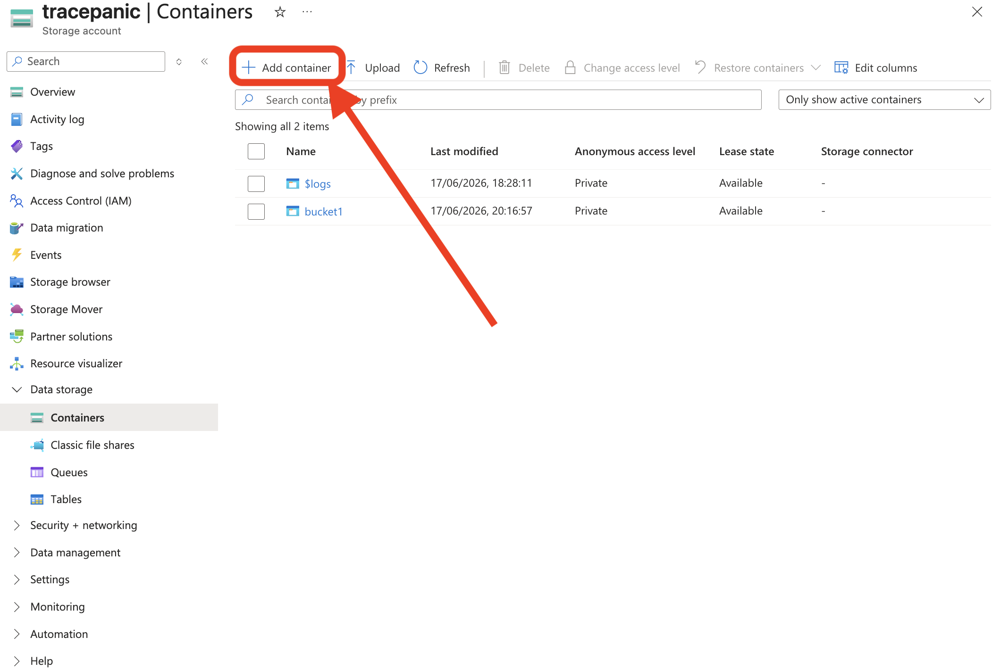
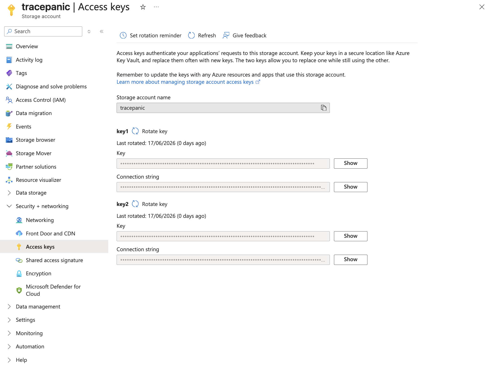

# Azure Blob Storage

Azure Blob Storage resources represent container-based object storage hosted on
Microsoft Azure.

## Inventory Management

Currently no
[managed inventory](../../infrastructure/inventories#managed-inventories) has
the capability of discovering Azure Blob Storage resources. You must configure a
[self-managed inventory](../../infrastructure/inventories/self-managed) before
adding an Azure Blob Storage resource.

### Adding Azure Blob Storage as a resource

When using a self-managed inventory, register the resource with `Object Storage`
as the class and `Azblob` as the subclass. For the endpoint, use the container
name. See
[Getting your credentials from Azure](#getting-your-credentials-from-azure) for
where to find the container name, and [resources documentation](../../resources)
for more information on how to set up resources on a self-managed inventory.

#### Backup flow

<!-- prettier-ignore-start -->

flowchart TD
  subgraph Azure["Azure Blob Container (source)"]
    Blobs["Blobs"]
  end

  subgraph Plakar["Plakar Control Plane"]
    Source["Azure Blob Source app"]
    Backup["Backup process Encrypt & deduplicate"]
  end

  Store["Kloset Store"]

  Source -->|"read blobs"| Blobs
  Blobs --> Backup
  Backup --> Store

<!-- prettier-ignore-end -->

#### Restore flow

<!-- prettier-ignore-start -->

flowchart TD
  Store["Kloset Store"]

  subgraph Plakar["Plakar Control Plane"]
    Destination["Azure Blob Destination app"]
    Restore["Restore process"]
  end

  subgraph Azure["Azure Blob Container (destination)"]
    Blobs["Blobs"]
  end

  Store --> Restore
  Destination --> Restore
  Restore -->|"write blobs"| Blobs

<!-- prettier-ignore-end -->

## Shared Configuration

The following settings are available when configuring source, store or
destination apps.

- **Account Name**: The name of the Azure Storage account, for example
  `mystorageaccount`.
- **Account Key**: The access key used to authenticate with the Azure Storage
  account.
- **Connection String**: The full Azure Blob Storage connection string, for
  example
  `DefaultEndpointsProtocol=https;AccountName=mystorageaccount;AccountKey=...;EndpointSuffix=core.windows.net`.
  When provided, this takes precedence over Account Name and Account Key.
- **Endpoint**: The Azure Blob service URL, for example
  `https://mystorageaccount.blob.core.windows.net`. Only needed when connecting
  to a non-standard endpoint such as Azurite for local development, or to
  resolve the storage account's service URL when Use Managed Identity is enabled
  without Account Name.
- **Managed Identity Client ID**: The client ID of the user-assigned managed
  identity to authenticate with. Only needed when authenticating with a
  user-assigned managed identity; leave unset to use the system-assigned managed
  identity.
- **No Auth**: Disables authentication entirely. Only useful for public blobs or
  local emulator setups such as Azurite. Should never be enabled in production.
- **Use Managed Identity**: Authenticates with Azure Active Directory using a
  [managed identity](https://learn.microsoft.com/en-us/entra/identity/managed-identities-azure-resources/overview)
  assigned to the environment Plakar Control Plane runs in, instead of an
  account key or connection string. Supports both system-assigned and
  user-assigned identities. It requires **Account Name** or **Endpoint** to be
  set so the storage account's service URL can be resolved, and cannot be
  combined with **Connection String**, **Account Key** or **No Auth**.

## Store configuration

The following extra settings are available when configuring a store app.

- **Kloset Passphrase**: The passphrase Plakar Control Plane uses to encrypt the
  store. This passphrase is required to access the store and must be kept safe.

## Getting your credentials from Azure

To use Azure Blob Storage, you first need to create a Storage Account and a
Resource Group for it. You can read more under
[Microsoft Storage Accounts](https://learn.microsoft.com/en-us/azure/storage/common/storage-account-overview)
documentation.

You can create a Storage Container from your Storage Account under **Data
Storage -> Containers**. Use the name of the container as the endpoint when
setting up the resource, as described in
[Adding Azure Blob Storage as a resource](#adding-azure-blob-storage-as-a-resource).

The other remaining credentials can be found under **Security + networking ->
Access Keys**

## Permissions

Plakar Control Plane requires a set of Azure RBAC permissions to access your
Blob Storage containers. These permissions should be assigned to a security
principal which is a user, group, service principal, or managed identity that
Plakar Control Plane will use to authenticate. Azure RBAC roles can be assigned
at the subscription, resource group, storage account, or container level. See
the
[Microsoft Entra ID](https://learn.microsoft.com/en-us/azure/storage/blobs/assign-azure-role-data-access)
documentation for instructions on how to assign roles.

| Permission                                                                            |
| ------------------------------------------------------------------------------------- |
| `Microsoft.Storage/storageAccounts/listKeys/action`                                   |
| `Microsoft.Storage/storageAccounts/read`                                              |
| `Microsoft.Storage/storageAccounts/blobServices/containers/read`                      |
| `Microsoft.Storage/storageAccounts/blobServices/containers/blobs/read`                |
| `Microsoft.Storage/storageAccounts/blobServices/containers/blobs/write`               |
| `Microsoft.Storage/storageAccounts/blobServices/containers/blobs/delete`              |
| `Microsoft.Storage/storageAccounts/blobServices/containers/blobs/tags/read`           |
| `Microsoft.Storage/storageAccounts/blobServices/containers/blobs/tags/write`          |
| `Microsoft.Storage/storageAccounts/blobServices/containers/blobs/versions/read`       |
| `Microsoft.Storage/storageAccounts/blobServices/containers/blobs/versions/delete`     |
| `Microsoft.Storage/storageAccounts/blobServices/containers/blobs/versions/tags/read`  |
| `Microsoft.Storage/storageAccounts/blobServices/containers/blobs/versions/tags/write` |

