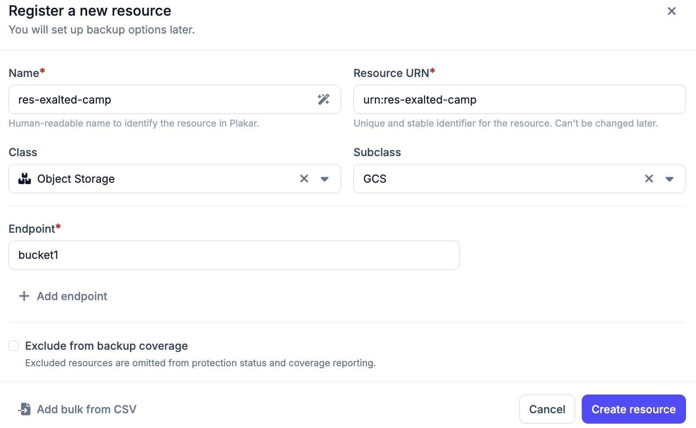

# Google Cloud Storage

Google Cloud Storage resources represent bucket-based object storage hosted on
Google Cloud. GCS buckets can be automatically discovered through a
[Google Cloud inventory](../../../infrastructure/inventories/google-cloud), or
added manually using a
[self-managed inventory](../../infrastructure/inventories/self-managed).

## Setting up with a Google Cloud inventory

If you have a Google Cloud inventory configured in Plakar Control Plane, GCS
buckets in your project are automatically discovered and available as resources.
No manual setup is needed, you can go directly to attaching a app to the
resource and configuring its credentials.

## Setting up with a self-managed inventory

If you are not using a Google Cloud inventory, you can create a self-managed
inventory to manage your GCS resources manually. Read the
[self-managed inventory](../../infrastructure/inventories/self-managed)
documentation for more information.

## Adding Google Cloud Storage as a resource

When using a Google Cloud inventory, buckets are automatically discovered. When
using a self-managed inventory, you need to register your resources manually or
import them from a CSV file.

To add a GCS bucket as a resource, use Object Storage as the `class` and GCS as
the `subclass`. For the endpoint, use the bucket name.

## Backup flow

<!-- prettier-ignore-start -->

flowchart TD
  subgraph GCS["GCS Bucket (source)"]
    Objects["Objects"]
  end

  subgraph Plakar["Plakar Control Plane"]
    Source["GCS Source app"]
    Backup["Backup process Encrypt & deduplicate"]
  end

  Store["Kloset Store"]

  Source -->|"read objects"| Objects
  Objects --> Backup
  Backup --> Store

<!-- prettier-ignore-end -->

## Restore flow

<!-- prettier-ignore-start -->

flowchart TD
  Store["Kloset Store"]

  subgraph Plakar["Plakar Control Plane"]
    Destination["GCS Destination app"]
    Restore["Restore process"]
  end

  subgraph GCS["GCS Bucket (destination)"]
    Objects["Objects"]
  end

  Store --> Restore
  Destination --> Restore
  Restore -->|"write objects"| Objects

<!-- prettier-ignore-end -->

## Configuration

Google Cloud Storage resources can be configured using a source, store, or
destination app.

### Credentials File

The path to a Google Cloud service account JSON key file on the machine running
Plakar Control Plane. Use this when you want to reference a key file on disk
rather than embedding the credentials directly.

### Credentials JSON

The full contents of a Google Cloud service account JSON key file, pasted
directly into the field. Use this instead of Credentials File when you want to
store the credentials inline without relying on a file path.

You only need to provide one of Credentials File or Credentials JSON.

### Endpoint

Optional. Overrides the default Google Cloud Storage API endpoint. Only needed
when connecting to a non-standard endpoint such as a local GCS emulator for
development and testing.

### No Auth

Optional. Disables authentication entirely. Only useful when connecting to a
local emulator that does not require credentials. Should never be enabled in
production.

## Permissions

Plakar Control Plane requires a set of IAM permissions to access your GCS
bucket. These permissions should be granted to the service account that Plakar
Control Plane will use to authenticate. See the documentation on
[Managing IAM Roles and Service Accounts on Google Cloud](../../../guides/google-cloud/iam-roles-and-service-accounts)
for instructions on how to create a custom role with these permissions and
generate a service account key.

| Permission               | Description                               |
| ------------------------ | ----------------------------------------- |
| `storage.buckets.get`    | Read bucket metadata and configuration    |
| `storage.objects.create` | Write backup data or restored objects     |
| `storage.objects.delete` | Prune old backups or clean before restore |
| `storage.objects.get`    | Read object content and metadata          |
| `storage.objects.list`   | List objects in a bucket                  |

