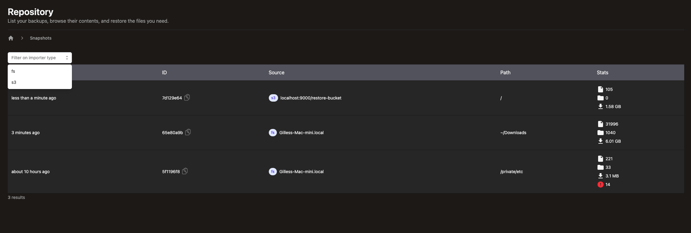
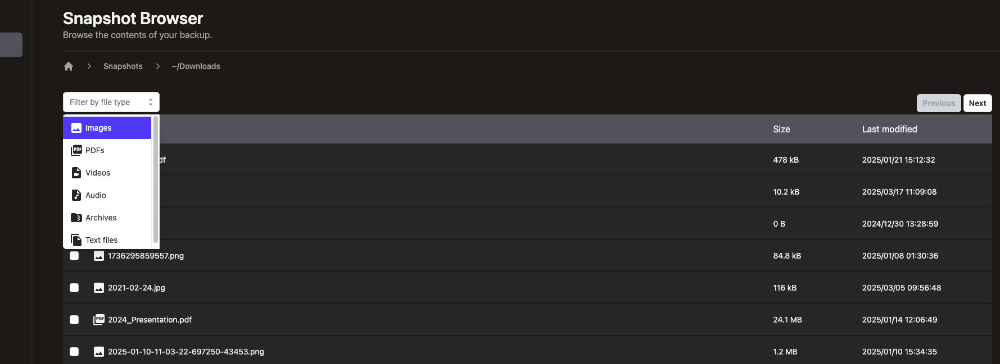
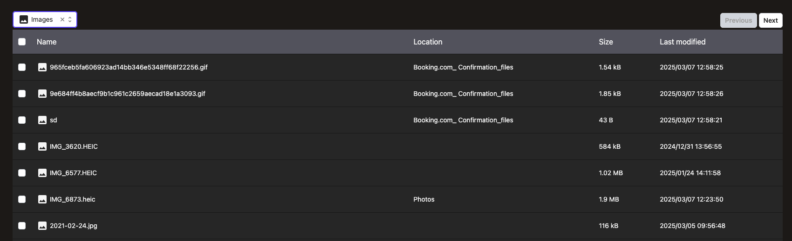
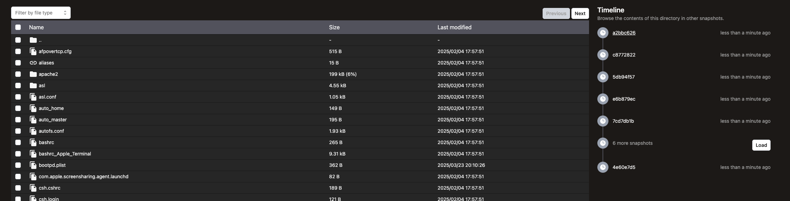
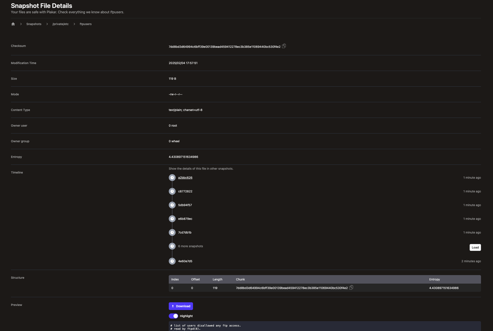

Hello, it's me again !

We released our first beta late February but we weren’t just going to sit back
and stay idle.

I'm glad to announce that we have just released `v1.0.1-beta.13`, our latest
version of `plakar`, incorporating several new features and solving some of the
bugs reported by early adopters.

```bash

$ go install github.com/PlakarKorp/plakar/cmd/plakar@v1.0.1-beta.13
```

We hope you will give it a try and
[give us with feedback](https://discord.com/invite/uuegtnF2Q5) !

---

## Web UI improvements

### Importer selection

So far, we have mainly displayed our ability to backup a local filesystem but
`plakar` can backup other sources of data such as S3 buckets or remote SFTP
directories.

We have extended the UI to allow filtering the snapshots per source type:



It is the first filtering out of a series of criteria matching to ease
identifying relevant snapshots.

### Content browsing

We also introduced MIME-based lists allowing to restrict the browsing to
specific types of files. It may seem like just a filter on top of results, but
it really leverages our snapshots built-in indexes API to provide fast browsing
through an overlay tree: the MIME browsing is a custom VFS with directories and
files matching a given MIME. We're essentially... a database now :-)



We currently provide a selection menu based on MIME main types, but it could be
turned into more specific browsing like restricting to `jpg` files rather than
all images. To see it in action, simply select a main type and see how the list
changes to only display relevant items:



This will be extended to support new ideas soon and our snapshots support
holding many such overlays, so we have room for creating very nice features on
top of this mechanism as we move forward.

### Timeline

When browsing a snapshot, each directory page now contains a Timeline widget:



This allows you to identify if that directory is also part of other snapshots,
and will soon also display if they are identical or not, pinpointing snapshots
that have divergences.

The timeline does not only work for directory but also for files, so that it is
possible to identify which snapshots carry a file and soon which ones have a
different version of it.



Considering that we are already able to provide `diff` unified patches between
two files of different snapshots, we're likely to provide features to ease
reverting from a specific version of a file in case a snapshot shows errors were
introduced.

We have lots of great ideas to build on top of this feature, so stay tuned for
more!

## New core features

### Checkpointing

Our software can now resume a transfer should the connection to a remote
repository drop. It implements it through checkpointing of transfers and
provides to-the-second resume for a backup originating from the same machine: if
you do a TB backup and connection drops after two hours, restarting a backup
will skip over all the chunks that have already been transmitted without
re-checking existence, leading to a fast resume from where it left.

This was introduced very recently and is a crucial component of our fully
lock-less design as will be discussed in a future tech article.

### FTP exporter

I feel almost ashamed to put that here, but hey... it's a new core feature.

We already supported creating a backup from a remote FTP server:

```bash
$ plakar backup ftp://ftp.eu.OpenBSD.org/pub/OpenBSD/7.6/arm64
```

We now can also restore a backup _to_ a remote FTP server:

```bash
$ plakar restore -to ftp://192.168.1.110/pub/OpenBSD/7.6/arm64 1f2a43a1
```

So, yes, I guess we're back in the 90s...

The good news is that this was unplanned and took only 20 minutes to implement,
providing a good skeleton to start from if you want to write your own exporter.

### Better S3 backend for repository

Plakar supports creating a repository in an S3 bucket, but that support was
limited to AWS and Minio instances. That limitation has been lifted and we can
now host repositories on a variety of S3 providers.

Sadly, we didn't implement the fix in the S3 exporter yet because... we forgot.

That should be done in next beta allowing us to restore to a variety of S3
providers too.

## Optimizations

We did a first round of optimizations in several places, the performance boost
is already very visible, but... this is the first round of many so expect
moooore speed :-)

### B+tree nodes caching

It doesn't show but `plakar` is actually closer to a database than it seems.

We don't just scan and record a list of files, we actually record them in a
B+tree data structure that is spread over multiple packfiles, with each node
uncompressed and decrypted on the fly as the virtual filesystem is being
browsed.

In previous betas, the B+tree didn't implement any caching whatsoever and was
the main point of contention. With this new beta, it comes with a nodes cache
that considerably boosts performances.

On my machine, a backup of the Korpus repository (>800k files) was 6x times
faster on a first run, and 10x times faster on a second run than before the
nodes caching was implemented.

Considering our constraint not to rely on in-memory indexes for scalability,
these kinds of performances boosts are impressive and bring us closer to other
solutions that work fully in-memory.

Other improvements to this are on their way so this is not the end of it !

### Parallelized check and restore

In previous betas, both `check` and `restore` subcommands were written to
operate sequentially, making them very slow as they would not make use of
machine resources to parallelize.

A first pass was done to parallelize them and, while the approach is still naive
with no caching and no shortcuts taken (identical resources are checked twice
rather than once), this already produced a x2 times boost on my machine for a
Korpus check and restore.

Check will be improved by using a cache to avoid re-doing the same work twice,
which should be very interesting on a large repository with lot of redundancy.

Restore is already operating at mostly top speed with the target being the
bottleneck, but there are still ideas to go one step further. We'll discuss that
when they have been PoC-ed or implemented.

### In-progress deduplication

We realized that due to our parallelization, chunks could sometimes be written
multiple times to a repository because a snapshot would spot them in different
files, realize they are not YET in the repository but not that they were already
seen in a different file.

We introduced a mechanism to track inflight chunk and discard duplicate requests
to record them to the repository, saving a bit more disk-space and maintenance
deduplication work.

## CDC attacks publication

Colin Percival from the <a href="https://tarsnap.com">Tarsnap project</a> has
co-authored a paper on attacks targeting CDC backup solutions:

<embed type="application/pdf" src="https://www.daemonology.net/blog/chunking-attacks.pdf" width="100%" height="750px" />

In this paper, they described Parameter Extraction attacks and
Post-Parametrization attacks against CDC backup solutions including
[Tarsnap](Tarsnap), [Restic](https://restic.net) and
[Borg](https://borgbackup.org).

> The attacker’s general goal is to find out what files the user has uploaded,
> either now or in the future.

The Parameter Extraction attacks targets CDC implementations relying on secret
values to setup the chunker: a random irreducible polynomial for Rabin (Restic),
a secret base and a prime modulus for Rabin-Karp (Tarsnap) and a random table of
numbers for Buzhash (Borg). We rely on FastCDC which uses a Gear table with
predetermined public values, parameters are therefore already known and our
security model relies on protecting data secrecy after it's been chunked.

The Post-Parametrization attacks are more interesting to us as we are in this
scenario. If we assume that an attacker knows the parameters of a chunker and
can observe storage or traffic, they can obtain some level of information about
a backup repository.

### Information leak

When an adversary knows the chunking parameters, they can simulate the chunking
process on known files to generate corresponding lists of chunk sizes. If they
also have a method to identify which chunk sizes are present in a repository,
they can infer with considerable confidence whether specific files exist.

For a simplified example, consider an attacker who chunks the `/bin` directory,
thereby obtaining a list of chunk sizes for each file. If the attacker then
monitors network traffic to my repository and observes the following sequence of
chunk sizes:

```bash
88320
106844
79623
86182
109251
122564
88059
75087
66823
82371
85138
68684
115906
119036
```

They could immediately conclude that the repository includes the `/bin/bash`
program, all without needing to analyze the actual content of the chunks.

### Attacks

Basically, there are two places where someone can tap into to deduce chunk
sizes: when chunks are stored and when they are retrieved.

#### Storage-time

During a backup `plakar` builds so-called _packfiles_ that bundle several chunks
together until they reach a maximum size. Several packfiles are created in
parallel, chunks from a same file are distributed across them so they are
interlaced, and they are encrypted with no delimited between them as to not
provide any indication of how many there are, where they begin or where they
end.

A server operator looking at a packfile will only see a string of seemingly
random bytes, whereas an attacker monitoring traffic will only be able to obtain
the size of a packfile itself which is fairly normalised.

#### Retrieval-time

During retrieval, two things happen: chunk existence test and chunk fetch.

The chunk existence test is done by fetching an encrypted index of chunks,
synchronizing to a local cache and resolving locally without querying the
repository: it is possible to validate that a repository holds the entire data
set without emitting any chunk requests to the repository.

A server operator looking at indexes will only see a string of seemingly random
bytes, whereas an attacker will only be able to obtain the size of the encrypted
index which does not provide much valuable information.

The chunk fetch is where we potentially leak information.

### Mitigations

On Friday, upon reading the paper, I came up with an immediate mitigation
mechanism that I called "read and discard".

Put very simply, whenever fetching a chunk it added a random overhead so that
the fetch would request more than the actual chunk size, and the extra bytes
would be discarded client side. Because the overhead is random, a chunk that is
accessed multiple times will result in different sizes for an attacker observing
traffic, not only obfuscating the actual size but also the fact that it is the
same chunk that was requested.

Sunday, I realized that Tarsnap implemented the
[Padmé](https://lbarman.ch/blog/padme/) scheme which is doing something similar
to mine but... WAY better in terms of not wasting too much data on overhead. I
looked into it, adapted my read and discard to use the same approach.

But then decided to push it a bit further.

Instead of applying the overhead as a padding and reading extra bytes from a
base offset, I used it to create a window containing the entire chunk and used a
random left shift to change the base offset. As long as the shift does not
exceed the overhead, the window is guaranteed to contain the full chunk. This
will produce the same size as a Padmé scheme for an attacker observing traffic,
but a server operator with access to the Range request will see different
offsets at each request targeting the same chunks. Of course given enough
traffic they could defeat this through a statistical analysis, but this makes it
harder than just having the fixed base offset and it comes for free.

Here's an example of it applied to a file access:

```bash
$ ./plakar cat 2f:/private/etc/passwd >/dev/null
off=126916 (-7) length=1085 (+17)
off=116762 (-1) length=91 (+4)
off=235207 (-1) length=87 (+0)
off=92866 (-0)  length=86 (+0)
off=126413 (-2) length=523 (+13)
off=93674 (-45) length=2157 (+4)
off=88353 (-5)  length=271 (+5)
off=69422 (-1)  length=187 (+0)
off=80981 (-24) length=4790 (+9)
```

This was committed today and users of our new beta will benefit from it without
even noticing !

## Final words

As we are heading to our first stable release in a few weeks, we are working
hard on squashing last bugs, polishing our tool, as well as implementing some
features that we consider essential for our first release.

Feel free to [hop on our discord](https://discord.com/invite/uuegtnF2Q5) (we're
friendly), talk to us, test and report bugs. All help is appreciated...

Also, there's a bunch of social media share buttons below, just saying !

