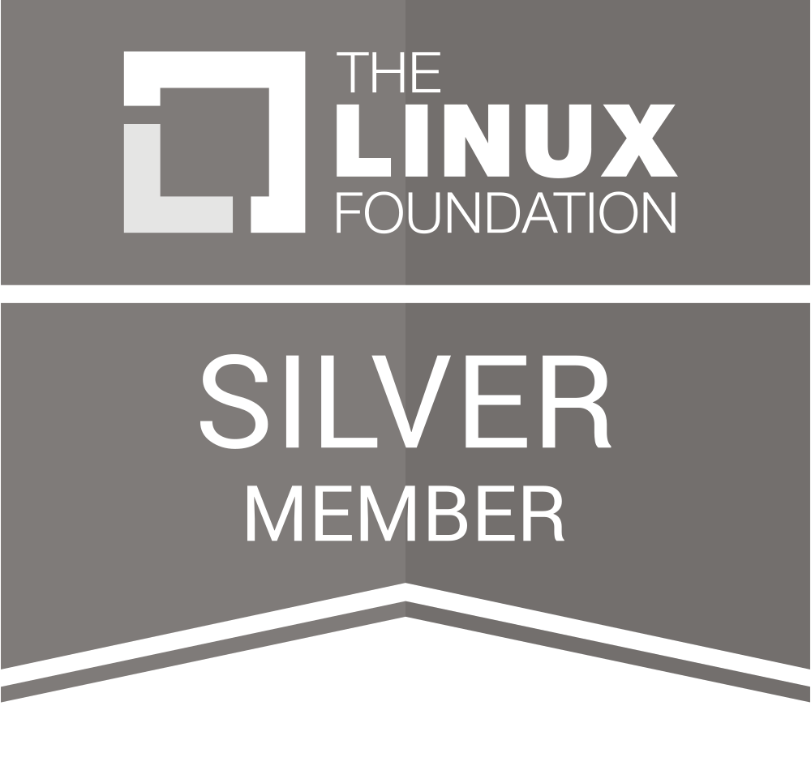
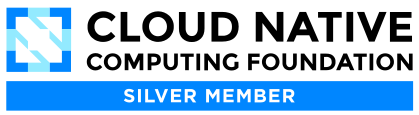

Today marks a significant step forward for our project and our community. We are
thrilled to announce that Plakar has officially joined the **Linux Foundation**
and the **Cloud Native Computing Foundation (CNCF)** as a member. This is an
important milestone in our mission to establish an Open Standard for Resilience.

  
  

We founded Plakar with a specific DNA: a convergence of hyperscale operations
and uncompromising security engineering, rooted in the OpenBSD philosophy. By
joining these foundations, we commit to bringing this rigor to the global Open
Source ecosystem. We believe that true resilience relies on transparency. You
cannot claim to secure critical infrastructure if the format protecting your
data remains a proprietary secret or a black box.

This membership is not just a formality; it strengthens our pledge to three core
principles that drive our engineering every day.

- **Radical Openness:** The format storing your data must be open, documented,
  and built to outlive the tools that created it. We are moving away from
  proprietary silos to a portable, content-addressed primitive.
- **Zero-Trust by Design:** In an adversarial environment, security cannot be an
  afterthought. Our core engine, Kloset, and our archive format, PTAR, are
  designed to ensure you never have to trust the infrastructure with your
  encryption keys.
- **Ecosystem Integration:** We are joining the table to collaborate with the
  industry leaders. Our goal is to ensure Plakar integrates seamlessly with the
  cloud-native stack, bridging the gap between modern workloads and traditional
  infrastructure without friction.

We are building the critical last line of defense, and we are doing it in the
open. This membership is a promise that Plakar will evolve with the strict
governance and transparency required by the modern cloud-native stack. We invite
every developer, engineer, and operator to be part of this journey.

Join the movement on **GitHub** and **Discord**

With **love**. ❤️

The Plakar team

