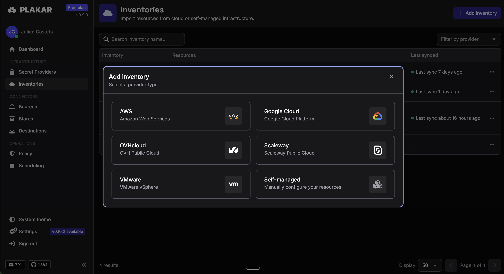

**TL;DR**

- **Plakar Control Plane is now on
  [AWS Marketplace](https://aws.amazon.com/marketplace/pp/prodview-n3wsyckyby6vq)**,
  deployable in a few clicks.
- **Self-hosted in your own AWS account**: delivered as an AMI; your backup data
  never leaves your environment.
- **Agentless protection for AWS resources** via native APIs, lightweight agents
  for on-prem and hybrid.
- **The off-AWS copy finally becomes affordable**: source-side dedup +
  client-side encryption cut egress and off-site storage to a fraction of the
  bytes.
- **Free plan**: fully functional, no time limit.

After several months in beta, with a group of early customers running Plakar
Control Plane against real production estates, **it's now available on the
[AWS Marketplace](https://aws.amazon.com/marketplace/pp/prodview-n3wsyckyby6vq).**
Anyone with an AWS account can deploy it into their own environment in a few
clicks. No data leaves your account: only consumption metrics for billing ever
reach us.

## Legacy backup hit a structural dead end

Data volumes double every three to four years, and encryption is now mandatory
against ransomware and breach. Legacy tools can't hold both at once: encrypt,
and you lose the storage efficiency that keeps backup affordable; stay
efficient, and you leave data exposed. Add an estate scattered across VMs,
databases, Kubernetes, cloud buckets, and SaaS, and you get governance blind
spots: nobody can say, with confidence, what's actually recoverable.

## The AWS backup math nobody likes

Run your backups inside AWS and the bill creeps up quietly: snapshot sprawl,
cross-region replication that doubles your storage, per-GB costs that grow every
time your data does. Annoying, but survivable.

The real problem is what it does to your security posture. Every serious
resilience playbook says the same thing: keep a copy off your primary provider:
the old
[3-2-1 rule](/posts/2025-02-11/the-3-2-1-backup-rule-a-proven-strategy-for-data-protection/).
On AWS, an off-provider copy means paying egress, and egress is billed per
gigabyte, every time. That makes a full second copy expensive enough that most
teams quietly skip it. So the only real copy of their data ends up in the same
account, the same provider, the same blast radius as production. If that account
is hit, whether by ransomware, stolen credentials, or a bad day for a region,
the backup goes down with everything else.

That copy outside AWS isn't a nice-to-have. It's the condition that makes your
data actually safe. Plakar's job is to make it affordable: high-ratio
source-side deduplication strips redundant data _before_ it ever leaves your
environment, so you pay egress and off-site storage on a fraction of the bytes.
And because every copy is encrypted client-side under keys you control, that
second copy is safe sitting on whatever storage is cheapest and most
independent: OVHcloud, Scaleway, on-prem, cold archive. The copy outside AWS
stops being the line item you cut, and becomes the one that saves you.

## Plakar Control Plane: declare resilience like you declare infrastructure

Control Plane is a self-hosted backup management platform enabling resilience as
code. It sits above the Plakar backup engine and gives security and
infrastructure teams four benefits legacy tooling can't:

- **Provable posture**: one
  [inventory](/docs/control-plane/infrastructure/inventories/) across VMs,
  databases, Kubernetes, buckets, and SaaS, showing what's protected, with
  integrity checks after every backup.
- **Safe, cost-efficient copies**: client-side deduplication and zero-trust
  encryption, stored on the provider of your choice.
- **Declarative policies**:
  [SLA policies](/docs/control-plane/operations/policies/) work like contracts:
  declare frequency, retention, and scope once, and the
  [policy scheduler](/docs/control-plane/operations/scheduling/policy-scheduler/)
  enforces them across every matching source. No per-source configuration to
  drift.
- **Strategic autonomy**: self-hosted, keys you control, an auditable codebase.
  No vendor sits between you and your recovery.

## What Control Plane protects

Plakar's open integrations cover the systems that actually make up a production
estate:

| Resource             | Integrations                                                                                                                                                                          |
| -------------------- | ------------------------------------------------------------------------------------------------------------------------------------------------------------------------------------- |
| **Databases**        | [PostgreSQL](/integrations/postgres/), [MySQL](/integrations/mysql/), SQLite, [etcd](/integrations/etcd/): consistent snapshots with SLA metadata                                     |
| **Object storage**   | [Amazon S3](/integrations/s3/), [Google Cloud Storage](/integrations/gcs/), [Azure Blob](/integrations/azblob/)                                                                       |
| **Kubernetes**       | [Cluster workloads](/integrations/kubernetes/), plus a dedicated Kubernetes operator                                                                                                  |
| **VMs & containers** | [Proxmox](/integrations/proxmox/), Docker volumes, [OCI images](/integrations/oci/)                                                                                                   |
| **Files & NAS**      | [Local filesystems](/integrations/fs/), [SFTP](/integrations/sftp/), [FTP](/integrations/ftp/), [WebDAV](/integrations/webdav/), and anything [rclone](https://rclone.org/) can reach |
| **SaaS & apps**      | [Notion](/integrations/notion/), [IMAP mailboxes](/integrations/imap/), [CalDAV](/integrations/caldav/), with more landing through the open [integrations](/integrations/) ecosystem  |

On AWS specifically,
[managed inventories](/docs/control-plane/infrastructure/inventories/aws/)
discover your resources agentlessly through native AWS APIs: EC2 instances, S3
buckets, and RDS PostgreSQL databases surface automatically, while lightweight
agents extend the same policies to on-prem and hybrid workloads.

Everything lands in the same inventory, under the same policies, visible in the
same posture view. No separate tool per resource type, no scripts held together
with cron and hope.

## Up and running in minutes

<!-- TODO(victor): validate steps against the actual onboarding flow -->

1. **Subscribe** on
   [AWS Marketplace](https://aws.amazon.com/marketplace/pp/prodview-n3wsyckyby6vq)
   and launch the appliance (AMI) in your own account.
2. **Connect an [inventory](/docs/control-plane/infrastructure/inventories/)**:
   point Control Plane at your AWS credentials and it syncs your resources
   automatically.
3. **Apply an [SLA policy](/docs/control-plane/operations/policies/)**: set
   frequency and retention, scope it by environment, data class, or tag; every
   matching source is scheduled automatically.
4. **Watch the first snapshots land**: deduplicated, encrypted under your keys,
   stored where you decided.

No SaaS control plane in the middle, no data path through our infrastructure.
You run it; we never see your data.

## Available now: on your cloud, on your terms

On AWS Marketplace you get what enterprises actually need to adopt fast:
streamlined procurement and governance, security-validated deployment,
consolidated AWS billing, and private pricing for larger commitments. Prefer
another home? Control Plane also runs on OVHcloud, Scaleway, and self-hosted VMs
today, with Azure and GCP next.

And there's a **free plan: fully functional, with no time limit.** Whether
you're an independent researcher, an NGO, an SMB, or an enterprise rebuilding
its cyber-resilience posture under board or regulator pressure, you can start
protecting real workloads today.

## The vision: an open standard for data resilience

Our mission is simple: make reliable backup accessible to everyone. Decouple
data protection from storage infrastructure, so you can delegate resilience to a
cloud, an MSP, or a teammate without ever surrendering access to your own data.

Backup anything. Store anywhere. Restore everywhere. That's **Open Resilience as
Code.**

## Explore Plakar Control Plane on AWS Marketplace

[**Get it on AWS Marketplace →**](https://aws.amazon.com/marketplace/pp/prodview-n3wsyckyby6vq)

Prefer to start with the open-source engine?
[**Download and deploy → plakar.io/download**](/download/)

## FAQ

**Does my backup data ever leave my AWS account?** No. Control Plane is
self-hosted in your own account. All data is encrypted client-side with keys you
exclusively control; only consumption metrics for billing ever reach Plakar.

**Can I keep a copy of my backups outside AWS?** Yes, that's the point.
Source-side deduplication shrinks what crosses the wire, so an off-AWS copy
(OVHcloud, Scaleway, on-prem, cold archive) becomes affordable instead of the
line item you cut.

**Is there really a free plan?** Yes. Fully functional, no time limit.
Enterprise features and support come with paid tiers.

**What if I'm not on AWS?** Control Plane also runs on OVHcloud, Scaleway, and
self-hosted VMs today, Azure and GCP are next.

