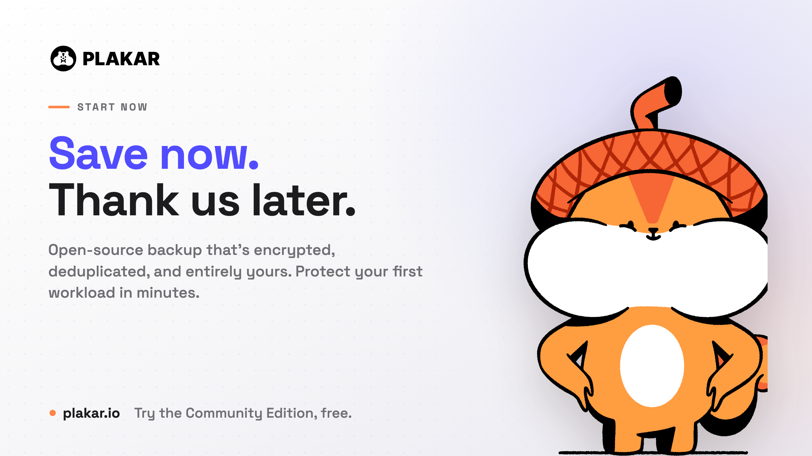

The cloud didn't repeal the oldest rule in data protection: you need offsite
backups. It just made it easy to forget. Most teams now keep their primary data,
their backups, and their recovery path with the **same provider, in the same
account, reachable exactly one way.** That's convenient right up until the
moment it isn't.

We've gotten very good at making _infrastructure_ resilient: autoscaling, health
checks, failover between regions. But almost all of that lives on the process
side, not the data side. Software exposed to the internet will be compromised
eventually, no matter how you isolate it, and the last line of defense you have
left is whatever you backed up and can actually restore.

An _independent backup_ fixes that. By independent, we mean a copy that:

- **You control**, encrypted with keys you hold, not the provider,
- lives in a **separate failure domain**: a different account, region, medium,
  or network, and
- is stored in an **open, portable format**, so it restores anywhere, on your
  terms.

This is the modern reading of the classic
**[3-2-1 rule](/posts/2025-02-11/the-3-2-1-backup-rule-a-proven-strategy-for-data-protection/)**:
keep **3** copies of your data, on **2** different types of media, with at least
**1** stored independently of your primary environment. The updated version
people use today, **3-2-1-1-0**, adds one _immutable or offline_ copy and **0**
recovery errors (meaning you've actually tested a restore).

Here are 10 reasons why you should consider independent copies of your important
data:

## 1. You hold the keys: privacy, compliance, and data governance

Control doesn't come from _where_ data sits. It comes from **who holds the
encryption keys and who can access it.** Cloud providers offer strong security
tools, but their trust boundary includes them: the provider, its operators, and
anyone who compromises either.

An independent backup,
[encrypted client-side](/posts/2025-02-28/audit-of-plakar-cryptography/) with
keys you own, gives you provable custody of sensitive data: customer PII,
medical records, financial data, IP. For a healthcare provider under HIPAA or a
law firm holding privileged client files, being able to show auditors _"we hold
the keys, the provider is blind to the contents"_ is a stronger governance story
than any shared-responsibility checkbox.

## 2. Ransomware and account compromise

Start from a hard assumption: any system exposed to the internet will be
compromised eventually, no matter how well you isolate it. When it happens, the
only thing standing between you and a total loss is a backup the attacker can't
reach. And attackers know it.

A cloud admin credential is the keys to the kingdom. Modern ransomware crews
don't just encrypt production, **they hunt for your backups first**, because
deleting your recovery option is what gives them leverage.
[Sophos found that in 94% of ransomware attacks the criminals tried to compromise the victim's backups](https://www.sophos.com/en-us/blog/the-impact-of-compromised-backups-on-ransomware-outcomes).
They'll wipe snapshots, empty buckets, or encrypt everything with their own keys
and offer to sell yours back.

The real defense isn't being "off-cloud." A network-connected NAS on a
compromised network gets encrypted too. It's **isolation plus immutability.**
Cloud object-lock helps, but it often lives in the _same account and trust
domain_ the attacker already controls. A genuinely independent copy,
[immutable](/posts/2025-04-29/kloset-the-immutable-data-store/), in a separate
credential domain, ideally air-gapped, is the one thing they can't reach or
rewrite.

## 3. Human error, and now AI agents

Not every threat is an attacker. Someone fat-fingers a delete, overwrites a file
with the wrong version, or runs a script against
[an S3 bucket that never had versioning enabled](/posts/2025-02-10/s3-is-not-a-backup-why-you-need-a-real-backup-strategy/).
Native version history helps, but it has retention limits, it can be turned off,
and the damage often isn't noticed until it's too late.

There's a new twist on this in 2026. The line between "trusted insider" and
"hostile actor" has blurred, because a growing share of destructive actions now
comes from automation. Teams run AI coding agents in auto or "YOLO" mode, hand
them API keys, and give them the same Docker and shell access a senior engineer
has, which on most machines is an escalation path straight to root. An agent
that drops a production database or wipes a directory to "fix" something isn't
malicious, but the outcome is identical to an attack: the data is gone. You
can't reliably enforce a no-agent policy, so the only safe assumption is that
some process, human or not, will eventually destroy data it had every permission
to touch.

An independent backup preserves historical copies **outside the normal
workflow**, so a mistake made on Monday, by a person or an agent, is still
recoverable long after your cloud retention window has rolled off.

## 4. Access when the cloud is unreachable

Three different failure modes share one symptom: **your data is fine, but you
can't get to it.**

- **Provider or regional outage:** a software bug or network fault takes a
  region offline.
- **Account lockout:** a billing dispute, a policy or fraud flag, or a legal
  hold freezes your account while it's "under review." Your files are there;
  your access isn't.
- **No connectivity:** a remote job site, a field team, or a region hit by
  severe weather simply can't reach the cloud.

A short interruption still stalls sales, support, and operations. An independent
copy you can reach on your own terms keeps the business running while the
dependency you _don't_ control gets sorted out.

And it can be worse than a temporary lockout. In 2024, a Google Cloud
misconfiguration
[deleted UniSuper's entire cloud subscription](https://www.business-standard.com/world-news/google-cloud-accidentally-deletes-125-billion-australian-pension-fund-124051800606_1.html),
taking a $125 billion pension fund offline. It came back only because it had
also kept an independent backup with a different provider.

## 5. Freedom from vendor lock-in

Storage you'll keep for years or decades shouldn't be hostage to one provider's
pricing, APIs, or proprietary format. The trap is rarely a single decision. It's
egress fees plus a format you can't easily read anywhere else, which together
make _leaving_ expensive enough that you don't.

An independent backup in an
**[open, portable format](/posts/2025-06-27/it-doesnt-make-sense-to-wrap-modern-data-in-a-1979-format-introducing-.ptar/)**
is your exit ramp. When pricing changes or priorities shift, you migrate at your
own pace instead of under pressure, because your data was never locked in to
begin with.

## 6. Faster, cheaper recovery at scale

Cloud storage is great for _keeping_ data. It's slow and pricey for _getting a
lot of it back_. Restoring hundreds of terabytes over an internet connection can
take days or weeks, and the egress and bandwidth bills add up fast. If your
[recovery-time objective (RTO)](/posts/2025-02-12/understanding-rto-and-rpo-in-disaster-recovery/)
is measured in hours, an internet-only restore blows past it before you've
pulled the first terabyte.

Be honest about the tradeoff: a local restore isn't instant either, and you need
somewhere to land the data. But a **nearby, deduplicated copy** shrinks both
sides of the problem: fewer physical bytes to move, and a fraction of the
transfer cost. When "download everything again" isn't practical, the independent
copy is what turns a multi-week recovery into a same-day one.

## 7. Hardware failure and silent data corruption

Drives wear out and silent corruption creep in over time. And redundancy doesn't
save you:
[replication faithfully copies corruption](/posts/2025-02-10/why-replication-is-not-backup/)
to every replica. **Redundancy is not integrity.**

An independent backup with real **integrity verification**, checksums and
content-addressed storage that can prove a copy is byte-for-byte what you
stored, lets you _detect_ corruption and restore a known-good version, not just
another copy of the damaged one.

There's a related trap: a backup you've never restored isn't a backup, it's a
hope. Plenty of teams discover at the worst possible moment that their
"geo-replicated" data was really just rsync on a schedule, and a silent error
meant weeks of snapshots went nowhere. Ask an engineer "when did you last test a
restore?" and watch the confidence drain. It is not rare: after a ransomware
attack, a
[French hospital discovered its server's backup system had never actually worked](https://www.clubic.com/actualite-604642-victime-d-une-cyberattaque-un-hopital-ardechois-fait-lourdement-condamner-son-ancien-prestataire-it-7-ans-apres.html),
leaving no usable archives to restore.

## 8. Climate change is putting data centers at physical risk

Data centers are physical buildings full of heat-sensitive hardware, and the
climate they operate in is getting harsher. In July 2022, a heatwave
[knocked **Google Cloud and Oracle** data centers in London offline](https://www.datacenterdynamics.com/en/news/googles-london-data-center-outage-during-heatwave-caused-by-simultaneous-failure-of-multiple-redundant-cooling-systems/)
when multiple redundant cooling systems failed at once. Floods, wildfires, water
scarcity that starves cooling systems, and seismic activity all threaten the
same physical layer. Sometimes it is brutally simple: in 2025, a
[data-center fire destroyed 858 TB of South Korean government records](https://www.techradar.com/pro/security/the-south-korean-government-has-learnt-they-need-a-backup-the-hard-way)
that had no backup at all.

The catch: these are **correlated, regional events.** In-region redundancy
doesn't help when the whole region is under a heat dome or a flood. An
independent copy in a **different geography and climate zone** is what survives
when the map turns red.

## 9. Conflict and attacks on physical infrastructure

Digital infrastructure has become physical infrastructure worth targeting. In
recent conflicts, data centers, and the fiber and **subsea cables** that connect
them, have been damaged or deliberately hit.
[Cable-cut incidents in the Baltic Sea](https://en.wikipedia.org/wiki/2024_Baltic_Sea_submarine_cable_disruptions)
and the Red Sea have disrupted connectivity for entire regions at a time. In
2026,
[drones struck Amazon's cloud data centers in the Gulf](https://theconversation.com/why-iran-targeted-amazon-data-centers-and-what-that-does-and-doesnt-change-about-warfare-278642),
the first deliberate strikes on private cloud infrastructure, taking banking and
enterprise services offline across the region.

This isn't about any one country. It's about **concentration risk.** If your
data and its recovery path depend on infrastructure clustered in a contested
region, or on a handful of cables, that's a single point of failure someone else
controls. An independent copy held **outside that blast radius, in a portable
format**, is strategic autonomy: your ability to recover doesn't depend on
geopolitics staying calm.

## 10. Keeping extra copies costs a fraction, not a multiple

The obvious objection to all of this is cost: if one copy is expensive, surely
three copies are three times worse. They would be, except that independent
copies are mostly _the same data you already have_. Deduplication stores each
unique block once, so a second or third copy adds only what actually changed,
not another full footprint.

Plakar is built around this. Its
[content-defined chunking](/posts/2025-07-11/introducing-go-cdc-chunkers-chunk-and-deduplicate-everything/)
splits data into variable-sized blocks, keeps only the unique ones, and
compresses what remains, reaching up to ~90% storage reduction. The hard part is
doing that on _encrypted_ data: most tools force a choice between encryption and
deduplication, because you can't dedupe bytes you can't read. Plakar
deduplicates across fully encrypted snapshots, so you keep zero-trust security
**and** a storage bill a fraction of the size. Storing less is greener, too: it
cuts the energy and water behind your data, no small thing when
[data-center electricity is set to more than double by 2030](https://www.iea.org/news/ai-is-set-to-drive-surging-electricity-demand-from-data-centres-while-offering-the-potential-to-transform-how-the-energy-sector-works).
That one capability is, on its own, a reason to run Plakar, and it's what turns
"keep an independent copy" from a budget fight into an easy call.

## "But isn't a second backup a hassle?"

Historically, yes. "Offsite backup" meant tapes in a van, per-workload agents,
and a lot of babysitting. That reputation is out of date. A modern independent
backup uses **one open format across VMs, databases,
[Kubernetes](/posts/2026-02-18/backing-up-kubernetes-clusters-with-plakar/), and
object storage**, needs no agents, and deduplicates so aggressively that the
copy you keep (and the data you move to restore it) is a fraction of the logical
size. It can be declared as code and automated like the rest of your
infrastructure. The second copy is far cheaper and lower-effort than the old
"offsite" reputation suggests.

## Where to start: rank your data by regret

You don't have to protect everything the same way. The practical first step is
an honest value assessment: for each dataset, ask how much it would hurt to lose
it, or to lose an hour, or a day, of it. Most people shrug at "my files" until
they picture losing every photo they've ever taken. Sort your data that way and
the critical 20% becomes obvious, along with how many copies, how often, and how
far apart each tier is worth. Then let deduplication make the expensive tiers
cheap enough that you don't have to cut corners on the data that matters.

## The bottom line

This was never really cloud versus not-cloud. It's **dependence versus
independence.** One provider, one account, one region, one network is one point
of failure wearing four disguises. Keep at least one copy that's yours,
encrypted with your keys, immutable, portable, and reachable on your terms, and
a catastrophe becomes an inconvenience.

That's exactly what **Plakar** is built for:
[open-source](/posts/2026-01-07/plakar-joins-the-linux-foundation-and-cloud-native-computing-foundation/),
encrypted-deduplicated, **immutable Kloset snapshots** in a portable format you
can self-host anywhere (on-prem, any cloud, or fully air-gapped) with the
**Kloset Vault Protocol** so you can even outsource storage to a provider that
stays cryptographically blind to your data.

**Try it free:** [plakar.io](/) and run `plakar backup` on your first workload
in minutes.

