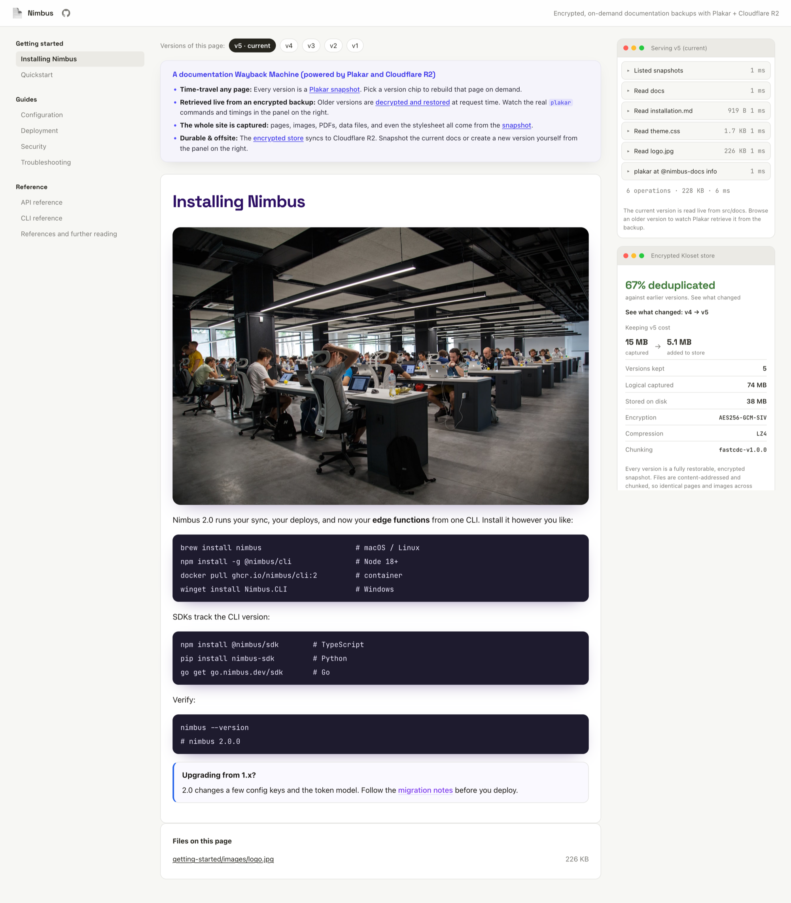
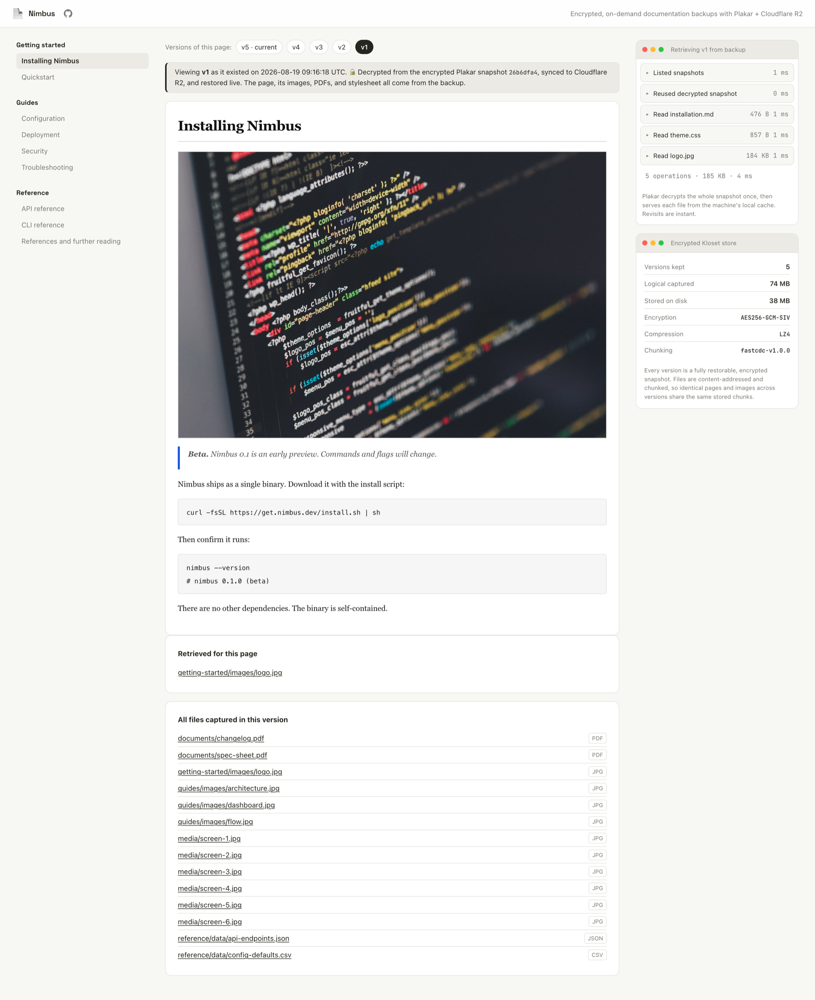
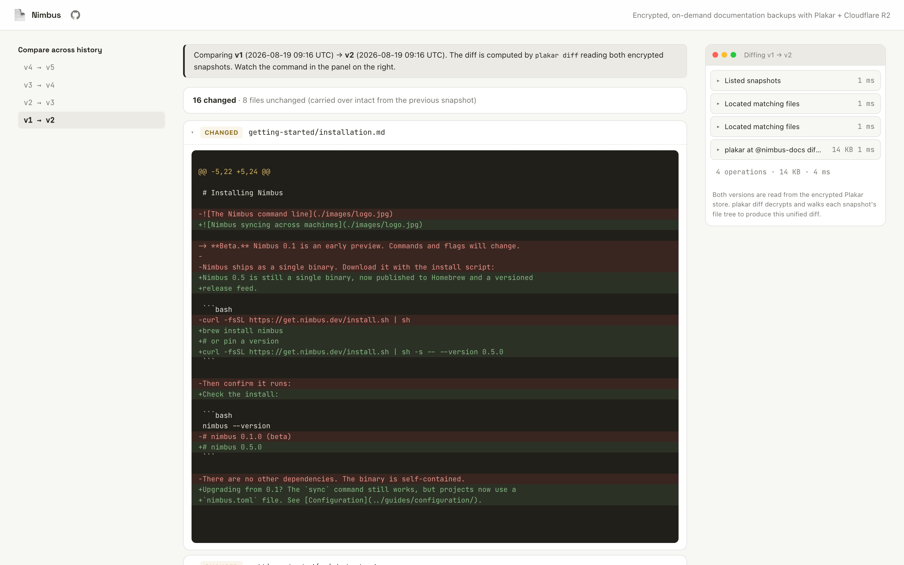
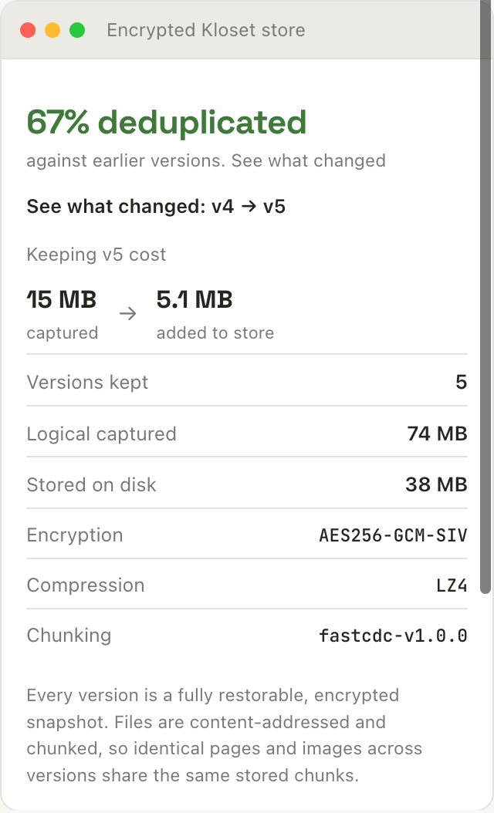

What if you could open your documentation as it stood on any past date, not just
today's page or an old commit's raw markdown? When a customer on a previous
release follows your install guide, or support reproduces their ticket, both
need the steps, screenshots, and default config exactly as they were in that
version. Yes, you can find those by hand, reading the old markdown on GitHub and
then browsing to each image and PDF it references at that commit, but it is slow
manual work for something you only need once in a while, on-demand.

This is where Plakar comes in. It can snapshot the whole docs site, its pages,
images, PDFs, and stylesheet, into an encrypted, content-addressed, immutable
[Kloset store](https://www.plakar.io/posts/2025-04-29/kloset-the-immutable-data-store/)
where every snapshot is fully restorable on-demand. This guide builds "Nimbus
Docs", an Astro application that serves any past version back at an archive URL
(`/archive/2026-03-01/getting-started`, for example).

You will use Plakar for the snapshots, an Astro server application for the
retrieval, and Cloudflare R2 to keep the encrypted store offsite.

## Demo

Try it at [astro-plakar-wayback.fly.dev](https://astro-plakar-wayback.fly.dev/).





v5 is the live version, read from `src/docs` on disk. The panel on the right
shows the breakdown of the plakar commands it ran to load the version, and the
store card below it shows how much size the version added after deduplication.







Opening v1 retrieves that snapshot from the encrypted backup. The page, its
version-correct screenshot, its PDFs, and its stylesheet all come out of the
same snapshot.







`plakar diff` reads both encrypted snapshots and returns a unified diff for
text, marks binaries as changed, and leaves unchanged files sharing their stored
chunks.







The store card compares the logical size against the real on-disk footprint,
reports the deduplication ratio between versions, and names the encryption,
compression, and chunking in use.







## Prerequisites

- Node.js 22 or newer
- [`plakar` 1.1.0 or newer](/docs/community/v1.1.0/quickstart/installation/) on
  the machine. The app runs `plakar` as a subprocess, so the binary has to be on
  your `PATH`.
- (Optional) A [Cloudflare](https://cloudflare.com) R2 bucket and API token,
  only if you want the archive kept offsite.

## Create the Astro application

Since there's lot to cover in this application, the easier way is to clone the
project, install its dependencies and then learn the core parts around plakar
powered snapshots, offsite backups, and encryption.

Run the following commands to clone and install the project:

```bash
# Clone the project
git clone https://github.com/rishi-raj-jain/astro-plakar-wayback
cd astro-plakar-wayback

# Install the dependencies
npm install
cp .env.example .env
```

It installs the following important dependencies:

- `astro` with `@astrojs/node`: the [Astro](https://astro.build/) framework and
  its Node.js adapter, so that pages can run on a live server that can shell out
  to `plakar`.
- `@astrojs/svelte` with `svelte`: to power the interactive islands, such as the
  live retrieval panel and the version action buttons.
- `marked`: to render each page's markdown to HTML.
- `gray-matter`: to parse the front matter (title, section) at the top of every
  markdown page.
- `aws4fetch`: to sign the S3-compatible requests that push and pull the store
  tarball on Cloudflare R2.

> [!NOTE]+ The Astro application is server-rendered
>
> Since retrieving an old version runs `plakar` on the fly and the action
> buttons execute real-time backups, the application needs a Node.js runtime
> with the `plakar` binary installed.

## Understand the Kloset store

The store is
[Plakar's immutable, content-addressed engine](/posts/2025-04-29/kloset-the-immutable-data-store/).
It splits every file into encrypted chunks, addresses each chunk by a hash of
its contents so an identical chunk is stored once, and never rewrites a chunk
after it is written. You can read the store's own properties with
[plakar info](/docs/community/v1.1.0/references/commands/plakar-info/), which
the application surfaces in a panel in the right sidebar: the data is
[encrypted](/docs/community/v1.1.0/explanations/how-plakar-works/#backing-up-encrypted-data)
with `AES256-GCM-SIV`,
[compressed](/docs/community/v1.1.0/explanations/how-plakar-works/#compression)
with LZ4, and split with the
[FastCDC content-defined chunker](/docs/community/v1.1.0/explanations/how-plakar-works/#content-defined-chunking-cdc).

## Point Plakar at the Kloset store

The application talks to a single Kloset store referenced as `@nimbus-docs`.
Encryption is a property of that store, set by a passphrase when the store is
created and supplied to every command through the `PLAKAR_PASSPHRASE`
environment variable in your `.env`. A new passphrase cannot open an old store,
so keep it safe.

## Seed the version history

To build the demo's history, run the following command:

```bash
npm run seed
```

The command above builds five states of the same docs site. It wipes the Kloset
store, then snapshots each of `seed/versions/v1` through `v5` in turn, leaving
`v5` in `src/docs` afterward. So v5 is both the newest snapshot and the live
current version the app serves from disk, while v1 through v4 are the archived
past versions it retrieves from the backup. Each state has the same file paths
with **different content, images, CSS, and embeds**.

To list the versions the application can access from the store, run
[plakar ls](/docs/community/v1.1.0/references/commands/plakar-ls/) as follows:

```bash
plakar at @nimbus-docs ls
```

It outputs one row per snapshot, newest first, each with a unique ID and
timestamp that the app numbers into v1, v2, and so on:

```
2026-03-05T09:14:02Z   a1b2c3d4   14 MiB   2s   /
2026-03-04T09:13:41Z   b2c3d4e5   14 MiB   2s   /
2026-03-03T09:13:19Z   c3d4e5f6   14 MiB   2s   /
2026-03-02T09:12:58Z   d4e5f6a7   14 MiB   2s   /
2026-03-01T09:12:36Z   e5f6a7b8   14 MiB   2s   /
```

## Read a page out of a snapshot

To read an archived page, use
[plakar locate](/docs/community/v1.1.0/references/commands/plakar-locate/) with
a snapshot ID. To list the set of files that match a glob expression in that
snapshot, run the following command:

```bash
plakar at @nimbus-docs locate -snapshot e5f6a7b8 '*.md'
```

It outputs the list of matching file names in the snapshot:

```bash
e5f6a7b8:/getting-started/installation.md
e5f6a7b8:/getting-started/quickstart.md
e5f6a7b8:/guides/configuration.md
e5f6a7b8:/reference/api.md
```

> [!NOTE]+
>
> With no `-snapshot` selector, `locate` searches every snapshot and returns the
> list of matching file names per version.

Then, use [plakar cat](/docs/community/v1.1.0/references/commands/plakar-cat/)
to print a single file's bytes to stdout:

```bash
plakar at @nimbus-docs cat e5f6a7b8:/getting-started/installation.md
```

Since `locate` prints one `snapshotID:/path` per line, the two commands compose
without any parsing in between.

The latest version of the docs is simply read from `src/docs` on disk, and every
older version is the `cat` as done above, run against a snapshot at request time
as implemented in
[`src/lib/docs.ts`](https://github.com/rishi-raj-jain/astro-plakar-wayback/blob/main/src/lib/docs.ts):

```typescript
// One code path, two sources.
if (version.live) {
  // Current version: read live from src/docs on disk.
  raw = readFileSync(page.path, "utf8");
} else {
  // Older version: decrypted out of its snapshot on demand.
  // Runs `plakar at @nimbus-docs cat <id>:<path>`.
  raw = readFile(version.id!, page.path, ops);
}
```

## Serve an archived page

To load an archived page, run the application in dev mode:

```bash
npm run dev
```

The app should be running on [localhost:4321](http://localhost:4321).

Now, visit `/archive/2026-03-01-e5f6a7b8/getting-started/installation` to see
that it renders that page as it was in `v1`.

The application decrypts the whole snapshot once with
[plakar restore](/docs/community/v1.1.0/references/commands/plakar-restore/)
into a temporary cache, then serves the page and every asset from it.

The first load takes a bit time to decrypt, but the repeat views are immediate
since they are being served from the cache. Older versions are retrieved on
demand this way
([`src/lib/restore.ts`](https://github.com/rishi-raj-jain/astro-plakar-wayback/blob/main/src/lib/restore.ts))
rather than pre-rendered at build time, so you are not restoring the entire
archive up front or on every deploy.

```typescript
export async function ensureRestored(
  snapshotId: string,
): Promise<RestoreResult> {
  const finalDir = join(RESTORE_ROOT, snapshotId);
  // Already decrypted: serve straight from local disk.
  if (existsSync(finalDir))
    return { dir: finalDir, cached: true, ms: 0, files: 0, bytes: 0 };

  // First hit: restore once. Concurrent callers await the same promise
  // instead of each spawning `plakar restore` (no cache stampede).
  let promise = inFlight.get(snapshotId);
  if (!promise) {
    promise = doRestore(snapshotId, finalDir); // restores to a .partial dir, then atomic rename
    inFlight.set(snapshotId, promise);
    void promise.finally(() => inFlight.delete(snapshotId));
  }
  await promise;
  return { dir: finalDir, cached: false, ...dirStats(finalDir) };
}
```

Also, the read-side Plakar calls are cached the same way. A `locate` or an
`info` result only changes when a backup writes to the store, so the application
keeps them in memory.

## Serve version-correct assets

The stylesheet, the hero image, and any embedded PDF on the page are all
rewritten to point at that same version's copies under `/assets/<version>/...`,
and those bytes are read from the same snapshot. So, the application builds the
page entirely from v1's own files, on-demand.

Every relative reference in the markdown in the previous version is resolved
against the version's own file list and pointed at the versioned asset route,
while external and absolute URLs are left untouched as implemented in
[`src/lib/docs.ts`](https://github.com/rishi-raj-jain/astro-plakar-wayback/blob/main/src/lib/docs.ts):

```typescript
const rewrite = (ref: string): string | null => {
  const slug = resolveRef(entries, pageSlug, ref);
  if (!slug) return null; // external or absolute: leave it alone
  referenced.add(slug);
  return `/assets/${version.key}/${slug}`;
};
```

That `/assets/<version>/...` route reads the bytes back out of the same restored
snapshot, so a request for a v1 image can only ever resolve to v1's copy:

```typescript
// src/pages/assets/[version]/[...path].ts
const { dir } = await ensureRestored(version.id!);
const asset = entriesFor(dir).assets.find((a) => a.slug === assetSlug);
if (asset) bytes = readFileSync(asset.path);
```

## Diff two versions

Because every version of the documentation is a snapshot, you can compare any
two of them with
[plakar diff](/docs/community/v1.1.0/references/commands/plakar-diff/) without
saving the markdown on disk:

```bash
plakar at @nimbus-docs diff -recursive e5f6a7b8 d4e5f6a7
```

The command above:

- For text files, returns a GitHub-like unified diff (`---` / `+++` / `@@`
  kind).
- For an image or a PDF, reports that the binary bytes changed, and it marks
  files that were added or removed between the two versions.

The app fetches the added and removed files from each version's own file list,
and takes the text hunks and binary markers from `plakar diff` as implemented in
[`src/lib/diff.ts`](https://github.com/rishi-raj-jain/astro-plakar-wayback/blob/main/src/lib/diff.ts):

```typescript
// Added / removed come from comparing the two file sets.
for (const slug of toFiles)
  if (!fromFiles.has(slug)) changes.push({ slug, kind: "added" });
for (const slug of fromFiles)
  if (!toFiles.has(slug)) changes.push({ slug, kind: "removed" });

// Text hunks and "binary files differ" come from plakar itself.
const changedByPlakar = parseDiff(diffRecursive(from.id!, to.id!, ops), roots);
```

## Verify the archive

To validate all the backups, run
[plakar check](/docs/community/v1.1.0/references/commands/plakar-check/) that
reads the store back, decrypts it, and recomputes checksums, exiting non-zero if
anything is corrupt:

```bash
plakar at @nimbus-docs check
```

## Create a new version

The "Create new version" button in the app edits the current docs into the next
version, backs it up as a new snapshot, and verifies the store:

```bash
plakar at @nimbus-docs backup ./src/docs
plakar at @nimbus-docs check
```

The [backup command](/docs/community/v1.1.0/references/commands/plakar-backup/)
writes the new version into the store as a snapshot, capturing pages, images,
PDFs, data files, and the stylesheet together.

It is implemented in
[`src/lib/actions.ts`](https://github.com/rishi-raj-jain/astro-plakar-wayback/blob/main/src/lib/actions.ts):

```typescript
// Back up the mutated docs, so v{nextNum} becomes the new saved current.
runPlakar(
  ["backup", DOCS],
  ops,
  `plakar at ${STORE_LABEL} backup ./docs (save v${nextNum})`,
);
runPlakar(["check"], ops, `plakar at ${STORE_LABEL} check`);
// the backup added a snapshot, so drop the cached ls / info
invalidatePlakarCache();
```

## Keep the archive offsite on Cloudflare R2

To save backups in durable storage, sync the encrypted store to Cloudflare R2.
It packs the store into a tarball and uploads it over R2's
[S3-compatible API](/docs/community/v1.1.0/integrations/s3/). Configure it with
an R2 API token in the `.env` file:

```bash
R2_ACCOUNT_ID=...
R2_ACCESS_KEY_ID=...
R2_SECRET_ACCESS_KEY=...
R2_BUCKET=plakar-docs-archive
```

The upload uses [aws4fetch](https://github.com/mhart/aws4fetch) to sign an S3
`PUT`, with a plain HTTP request, as implemented in
[`src/lib/r2.ts`](https://github.com/rishi-raj-jain/astro-plakar-wayback/blob/main/src/lib/r2.ts):

```typescript
export async function putObject(
  body: Uint8Array,
  key = R2_OBJECT,
): Promise<void> {
  const res = await client().fetch(objectUrl(key), {
    method: "PUT",
    body,
    headers: { "content-type": "application/gzip" },
  });
  if (!res.ok) throw new Error(`R2 PUT ${res.status} ${res.statusText}`);
}
```

Since the object in R2 is the same encrypted store, a fresh machine can pull the
tarball back down and serve the entire history without any of the plaintext ever
leaving the store.

## Deploy to Fly

The app runs `plakar` as a subprocess, so it needs a long-lived Node.js process.
[Fly](https://fly.io) fits this use case well: the
[`Dockerfile`](https://github.com/rishi-raj-jain/astro-plakar-wayback/blob/main/Dockerfile)
installs the `plakar` binary, and
[`fly.toml`](https://github.com/rishi-raj-jain/astro-plakar-wayback/blob/main/fly.toml)
mounts a persistent volume so the store and the live docs are present even after
restarts:

```toml
# fly.toml
[[mounts]]
  source = "plakar_data"
  destination = "/data"
```

Set `app` in `fly.toml` to a unique name, then create the app, provision the
volume, and deploy:

```bash
fly apps create <name>
fly volumes create plakar_data --region iad --size 1
fly deploy
fly open
```

To keep the offsite copy and set the store passphrase, add them as Fly secrets
before the first deploy:

```bash
fly secrets set PLAKAR_PASSPHRASE=...
fly secrets set R2_ACCOUNT_ID=... R2_ACCESS_KEY_ID=... R2_SECRET_ACCESS_KEY=...
```

A new passphrase cannot open an old store, so set `PLAKAR_PASSPHRASE` before the
store is created, or keep the `wayback-demo` default while you are only trying
it out.

## Summary

You now have an Astro application that snapshots a whole docs site into an
encrypted, content-addressed Kloset store and serves any past version back at a
URL. `ls` lists the versions, `locate` and `cat` read a page out of one
snapshot, `restore` decrypts a version into a cache for fast repeat views,
`diff` compares any two versions line by line, and `check` verifies the archive
before it syncs offsite to Cloudflare R2.

